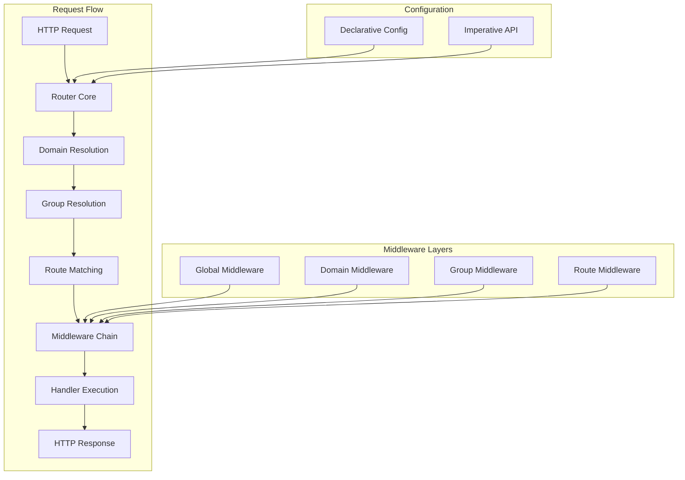
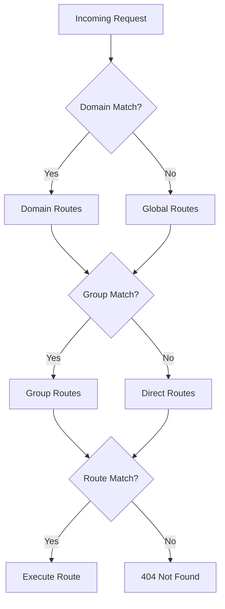
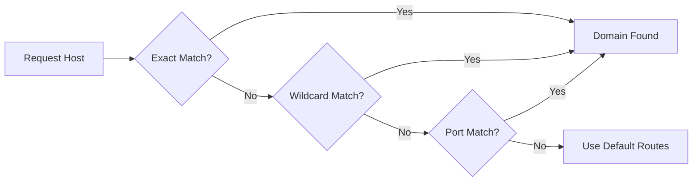
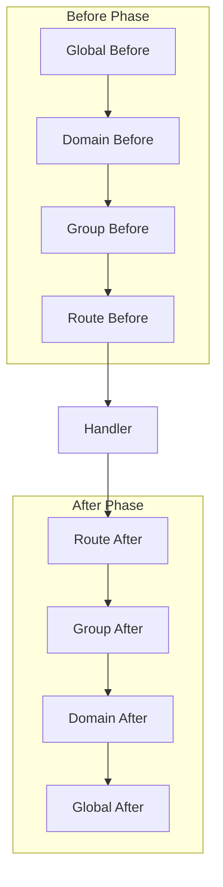
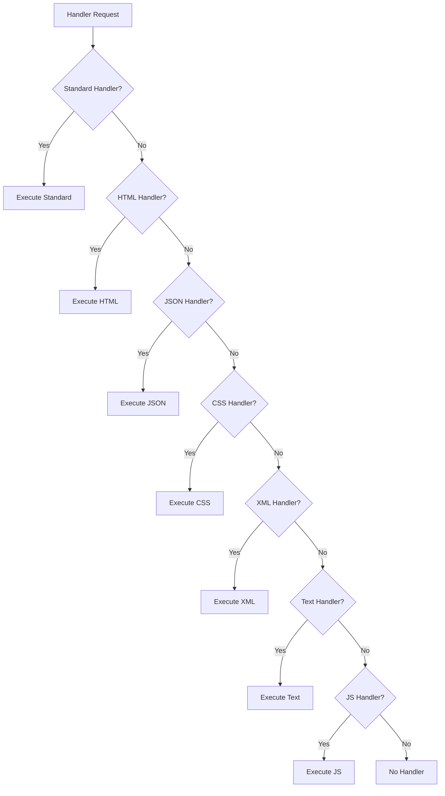
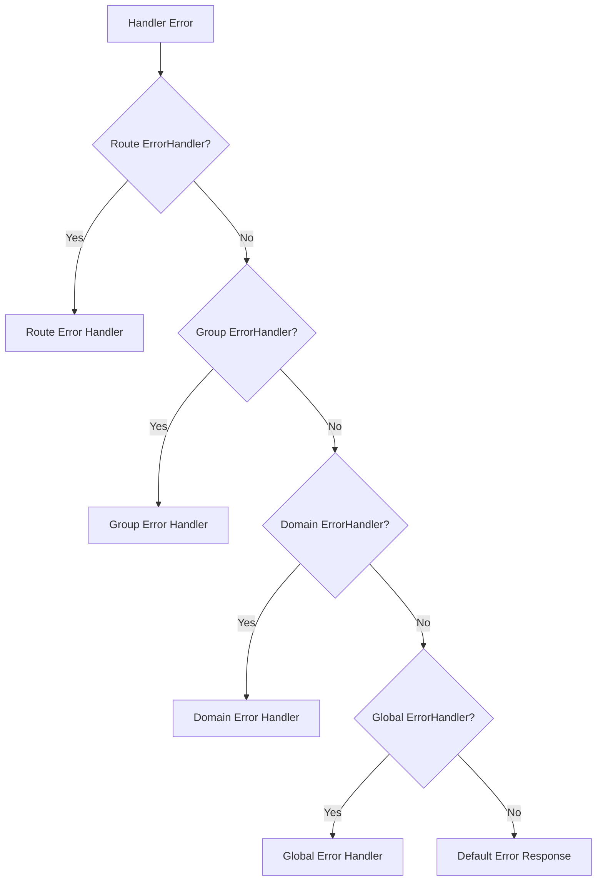

# RTR Router Architecture

This document provides a comprehensive overview of the RTR router's architecture, design patterns, and the technical decisions that shape its behavior.

## System Overview

RTR follows a layered architecture that separates concerns while maintaining high performance and flexibility. The router is designed to be both simple to use and powerful enough for complex applications.



## Core Components

### Router Core

The router core is the central component that orchestrates the entire request processing pipeline. It's responsible for:

- Request routing and dispatching
- Component lifecycle management
- Configuration integration
- Error handling and recovery

**Key Design Decisions:**
- Implements `http.Handler` interface for seamless standard library integration
- Supports both imperative and declarative configuration approaches
- Uses a tree-based structure for efficient route matching
- Maintains separate registries for routes, groups, and domains

### Route System

Routes are the fundamental building blocks that map HTTP methods and path patterns to handlers.

#### Route Matching Algorithm



#### Path Pattern Processing

RTR supports sophisticated path patterns with multiple parameter types:

1. **Required Parameters**: `:param` or `{param}`
2. **Optional Parameters**: `:param?` or `{param?}`
3. **Greedy Parameters**: `:param...` or `{param...}`
4. **Wildcard Routes**: `/*` (non-capturing)

**Pattern Normalization:**
- Brace-style parameters are normalized to colon syntax
- Inline regex patterns are stripped (parameter name retained)
- Greedy parameters must be the last segment

### Group System

Groups provide hierarchical organization of routes with shared characteristics:

```go
// Group hierarchy example
apiGroup := rtr.NewGroup().SetPrefix("/api")
v1Group := rtr.NewGroup().SetPrefix("/v1")
usersGroup := rtr.NewGroup().SetPrefix("/users")

// Nested structure: /api/v1/users
apiGroup.AddGroup(v1Group)
v1Group.AddGroup(usersGroup)
```

**Group Features:**
- Path prefix inheritance
- Middleware inheritance and composition
- Nested group support
- Independent route management

### Domain System

Domain-based routing enables different routing configurations based on the request hostname:

#### Domain Matching Logic



**Supported Patterns:**
- Exact domains: `example.com`
- Wildcard subdomains: `*.example.com`
- Port-specific: `example.com:8080`
- Wildcard ports: `example.com:*`
- IPv4/IPv6 addresses: `127.0.0.1:8080`, `[::1]:3000`

## Middleware Architecture

### Execution Chain

The middleware system follows a strict execution order that ensures predictable behavior:



### Middleware Types

#### Standard Middleware (`StdMiddleware`)
```go
type StdMiddleware func(http.Handler) http.Handler
```
- Follows the standard Go middleware pattern
- Composable and chainable
- Compatible with existing middleware ecosystem

#### Named Middleware (`MiddlewareInterface`)
```go
type MiddlewareInterface interface {
    GetName() string
    SetName(name string) MiddlewareInterface
    GetHandler() StdMiddleware
    SetHandler(handler StdMiddleware) MiddlewareInterface
    Execute(next http.Handler) http.Handler
}
```
- Provides metadata and debugging capabilities
- Supports middleware identification and naming
- Enables middleware introspection and documentation

### Middleware Configuration

RTR supports both imperative and declarative middleware configuration:

#### Imperative Approach
```go
router.AddBeforeMiddlewares([]rtr.MiddlewareInterface{
    rtr.NewAnonymousMiddleware(loggingMiddleware),
})
```

#### Declarative Approach
```go
config := rtr.RouterConfig{
    BeforeMiddleware: []rtr.MiddlewareConfig{
        rtr.NewMiddlewareConfig("Logger", loggingMiddleware),
    },
}
```

## Handler System

### Handler Hierarchy

RTR supports multiple handler types with automatic priority resolution:



### Handler Types and Use Cases

| Handler Type | Use Case | Auto Content-Type |
|-------------|----------|------------------|
| `StdHandler` | Full HTTP control | No |
| `HTMLHandler` | HTML responses | `text/html; charset=utf-8` |
| `JSONHandler` | JSON APIs | `application/json` |
| `CSSHandler` | Stylesheets | `text/css` |
| `XMLHandler` | XML data | `application/xml` |
| `TextHandler` | Plain text | `text/plain; charset=utf-8` |
| `JSHandler` | JavaScript | `application/javascript` |
| `ErrorHandler` | Error handling | Depends on error |

## Configuration Architecture

### Declarative Configuration System

The declarative system enables configuration-as-code with full serialization support:

```go
type RouterConfig struct {
    Name              string
    BeforeMiddleware  []MiddlewareConfig
    AfterMiddleware   []MiddlewareConfig
    Routes            []RouteConfig
    Groups            []GroupConfig
    Domains           []DomainConfig
}
```

**Key Benefits:**
- Serializable to JSON/YAML
- Testable configuration
- Clear intent and structure
- Tooling-friendly

### Configuration Conversion

RTR provides seamless conversion between configuration and runtime types:


**Conversion Functions:**
- `MiddlewareConfigsToInterfaces()`
- `InterfacesToMiddlewareConfigs()`
- `StdMiddlewaresToConfigs()`

## Performance Considerations

### Route Matching Optimization

- **Tree-based routing**: Efficient prefix tree for path matching
- **Parameter extraction**: Single-pass parameter parsing
- **Minimal allocations**: Reuse objects where possible
- **Early termination**: Stop matching on first successful route

### Memory Management

- **Object pooling**: Reuse frequently allocated objects
- **Lazy evaluation**: Defer expensive operations until needed
- **Efficient data structures**: Use appropriate data structures for each use case

### Benchmark Performance

```
BenchmarkRouter/Static-8     5000000   300 ns/op   32 B/op   1 allocs/op
BenchmarkRouter/Param-8      3000000   450 ns/op  160 B/op   4 allocs/op
BenchmarkRouter/Regexp-8     2000000   700 ns/op  320 B/op   6 allocs/op
```

## Error Handling Architecture

### Error Propagation



### Recovery Strategy

- **Panic Recovery**: Built-in recovery middleware
- **Error Wrapping**: Contextual error information
- **Graceful Degradation**: Fallback responses
- **Logging Integration**: Automatic error logging

## Testing Architecture

### Test Organization

```
router_test.go              # Core router functionality
route_test.go               # Route-specific tests
group_test.go               # Group functionality tests
domain_test.go              # Domain routing tests
middleware_test.go          # Middleware system tests
integration_test.go         # End-to-end tests
examples/                   # Practical examples with tests
```

### Test Patterns

- **Unit Tests**: Individual component testing
- **Integration Tests**: Component interaction testing
- **Benchmark Tests**: Performance validation
- **Example Tests**: Documentation validation

## Extension Points

### Custom Middleware

```go
func customMiddleware(next http.Handler) http.Handler {
    return http.HandlerFunc(func(w http.ResponseWriter, r *http.Request) {
        // Custom logic here
        next.ServeHTTP(w, r)
    })
}
```

### Custom Handlers

```go
// Implement any of the handler types
router.AddRoute(rtr.NewRoute().
    SetStringHandler(func(w http.ResponseWriter, r *http.Request) string {
        return "Custom response"
    }))
```

### Custom Route Matching

While RTR doesn't currently expose custom route matching, the architecture supports future extensions for:
- Custom pattern matching
- Advanced routing rules
- Dynamic route generation

## Design Principles

### 1. Simplicity
- Clear, intuitive APIs
- Minimal required configuration
- Sensible defaults

### 2. Flexibility
- Multiple configuration approaches
- Extensible middleware system
- Various handler types

### 3. Performance
- Optimized routing algorithms
- Minimal memory allocations
- Efficient request processing

### 4. Compatibility
- Standard library integration
- Existing middleware compatibility
- Go ecosystem alignment

### 5. Testability
- Comprehensive test coverage
- Testable configuration
- Clear separation of concerns

## Future Architecture Evolution

The current architecture is designed to evolve with future requirements:

### Planned Enhancements
- Advanced route matching algorithms
- Plugin system for extensions
- Configuration validation
- Performance monitoring integration

### Extension Points
- Custom route resolvers
- Advanced middleware composition
- Dynamic configuration loading
- Metrics and observability

## See Also

- [API Reference](api_reference.md) - Complete API documentation
- [Middleware Guide](modules/middleware.md) - Middleware system details
- [Configuration Guide](configuration.md) - Configuration options and patterns
- [Development Guide](development.md) - Contributing and extending RTR
