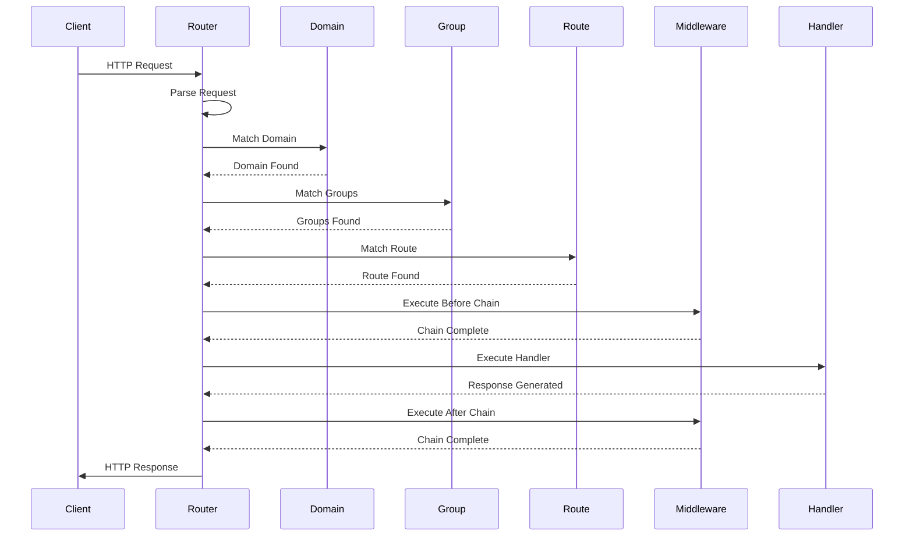
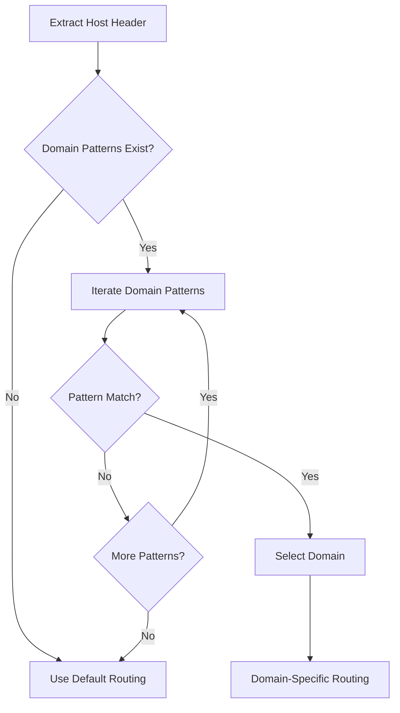
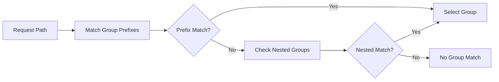
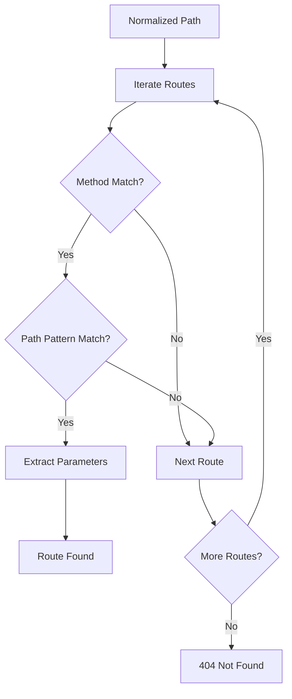
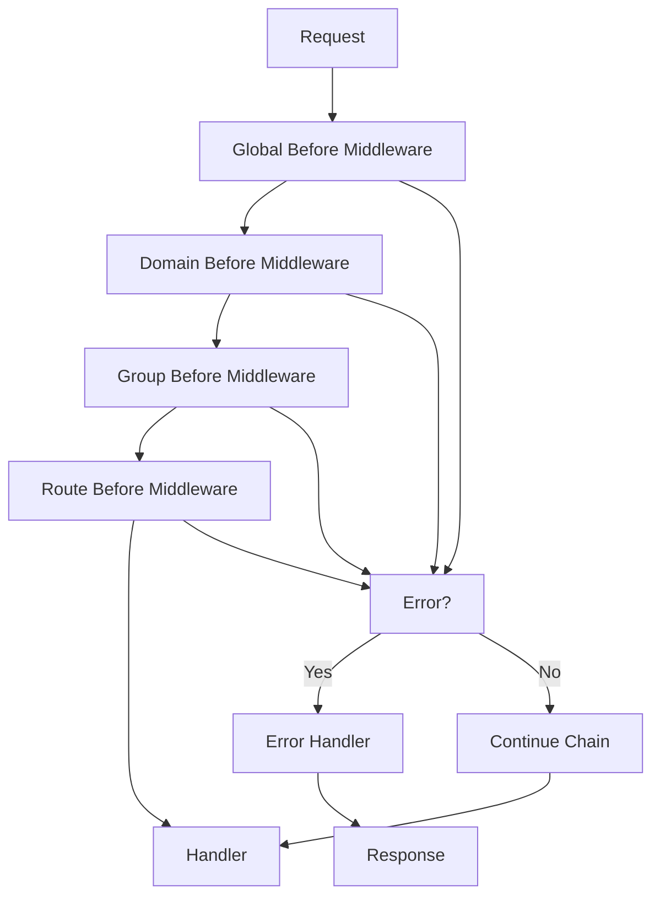
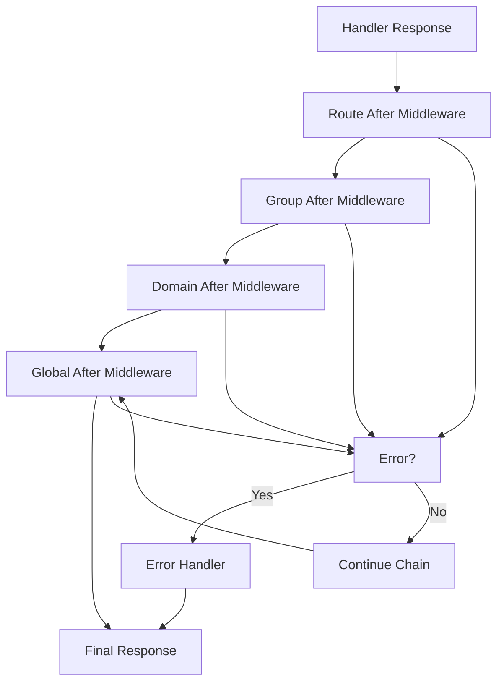
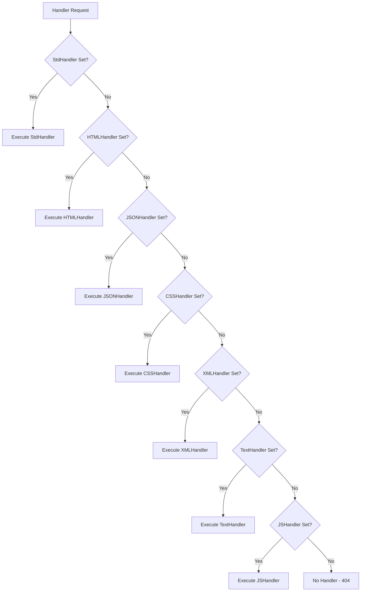
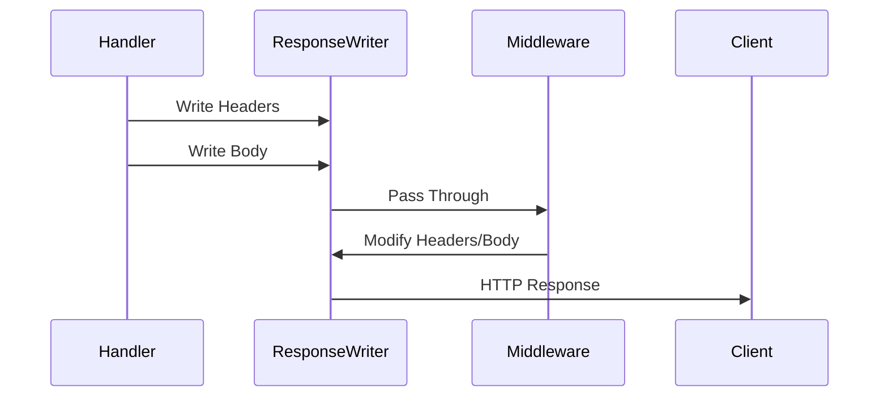
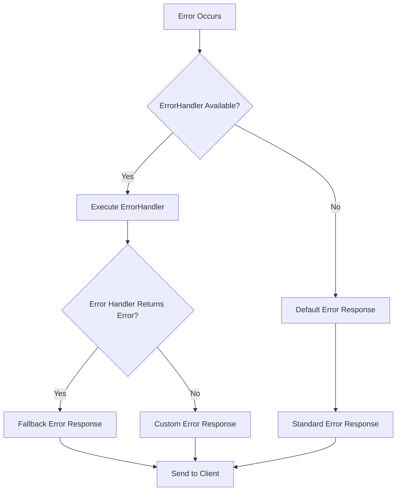
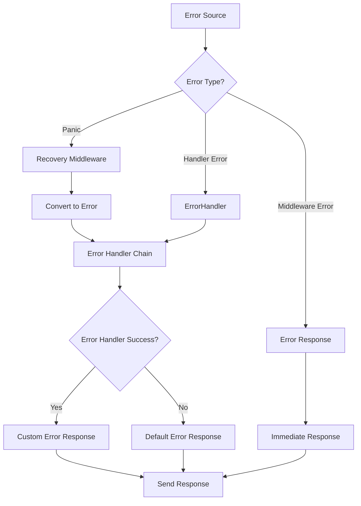

# RTR Router Data Flow

This document explains how data flows through the RTR router system from incoming HTTP requests to outgoing responses.

## Request Lifecycle Overview



## Detailed Request Processing

### 1. Request Reception

The router receives an HTTP request through its `ServeHTTP` method:

```go
func (router *routerImpl) ServeHTTP(w http.ResponseWriter, r *http.Request) {
    // Request processing begins here
}
```

**Request Data Extracted:**
- HTTP Method (GET, POST, etc.)
- Request Path (URL.Path)
- Host Header (for domain matching)
- Query Parameters
- Headers
- Body (if applicable)

### 2. Domain Resolution

The router attempts to match the request against configured domains:



**Domain Matching Logic:**
1. Extract host from `Host` header
2. Remove port if present (unless port-specific pattern)
3. Match against exact domain patterns
4. Match against wildcard patterns (`*.example.com`)
5. Consider port-specific patterns (`example.com:8080`)
6. Select first matching domain or use default

### 3. Group Resolution

Within the selected domain (or default), the router resolves route groups:



**Group Resolution Process:**
1. Extract request path
2. Match against group prefixes in order of addition
3. Support nested group resolution
4. Select longest matching prefix
5. Create group hierarchy for middleware composition

### 4. Route Matching

The router attempts to match the request path against configured routes:



**Route Matching Algorithm:**
1. Normalize request path (remove query string, handle trailing slashes)
2. Filter routes by HTTP method
3. Match path patterns against request path
4. Extract path parameters during matching
5. Select first matching route
6. Store parameters in request context

### 5. Path Parameter Extraction

During route matching, path parameters are extracted and stored:

```go
// Example: /users/:id/posts/:post_id
// Request: /users/123/posts/456
// Result: map[string]string{"id": "123", "post_id": "456"}
```

**Parameter Types:**
- **Required**: `:param` - must be present
- **Optional**: `:param?` - may be omitted
- **Greedy**: `:param...` - captures remainder of path

**Storage:**
- Parameters stored in request context
- Accessible via `GetParam()` and `MustGetParam()`
- Available throughout request lifecycle

## Middleware Execution Flow

### Before Middleware Chain



**Execution Order:**
1. Global before middleware (router level)
2. Domain before middleware (if domain matched)
3. Group before middleware (if groups matched)
4. Route before middleware (route specific)

**Error Handling:**
- Any middleware can return an error response
- Chain execution stops on first error
- Error responses bypass remaining middleware and handler

### After Middleware Chain



**Execution Order:**
1. Route after middleware
2. Group after middleware
3. Domain after middleware
4. Global after middleware

## Handler Execution

### Handler Selection

RTR supports multiple handler types with priority-based selection:



**Handler Priority Order:**
1. `StdHandler` - Full HTTP control
2. `HTMLHandler` - HTML with auto headers
3. `JSONHandler` - JSON with auto headers
4. `CSSHandler` - CSS with auto headers
5. `XMLHandler` - XML with auto headers
6. `TextHandler` - Text with auto headers
7. `JSHandler` - JavaScript with auto headers

### Response Generation

Different handler types generate responses differently:

#### Standard Handler
```go
func(w http.ResponseWriter, r *http.Request) {
    // Full control over response
    w.Header().Set("Content-Type", "application/json")
    w.WriteHeader(http.StatusOK)
    w.Write([]byte(`{"message": "success"}`))
}
```

#### Specialized Handlers
```go
func(w http.ResponseWriter, r *http.Request) string {
    // Return content string, headers set automatically
    return `{"message": "success"}`
}
```

**Automatic Header Setting:**
- HTML: `Content-Type: text/html; charset=utf-8`
- JSON: `Content-Type: application/json`
- CSS: `Content-Type: text/css`
- XML: `Content-Type: application/xml`
- Text: `Content-Type: text/plain; charset=utf-8`
- JS: `Content-Type: application/javascript`

## Response Flow

### Response Processing



**Response Writer Behavior:**
- Headers can be written before body
- Once body writing starts, headers are committed
- Middleware can modify headers before commitment
- Response buffering for certain middleware types

### Error Response Flow



## Context Data Flow

### Request Context

RTR uses the standard Go `context.Context` for request-scoped data:

```go
// Parameters stored in context
ctx := context.WithValue(r.Context(), paramsKey, params)
r = r.WithContext(ctx)
```

**Context Data:**
- Path parameters
- Request ID (if middleware added)
- User authentication data
- Request timing information
- Custom middleware data

### Context Access Patterns

```go
// Access parameters
userID := rtr.MustGetParam(r, "id")

// Access custom context data
if userID := r.Context().Value("userID"); userID != nil {
    // Use user ID
}
```

## Performance Considerations

### Memory Allocation

**Minimal Allocation Strategy:**
- Reuse parameter maps where possible
- Avoid unnecessary string copying
- Use object pools for frequently allocated objects
- Buffer response writing when beneficial

### Execution Path Optimization

**Optimizations Applied:**
- Early route termination on match
- Efficient parameter extraction
- Minimal middleware overhead
- Fast path for common cases

### Benchmark Performance

```
Request Processing Times:
- Static route: ~300ns
- Parameter route: ~450ns  
- Complex middleware chain: ~700ns
```

## Error Handling Flow

### Error Propagation



### Error Types

**Common Error Scenarios:**
- Route not found (404)
- Method not allowed (405)
- Parameter extraction errors
- Middleware execution errors
- Handler panics
- Network errors

## Debugging and Tracing

### Request Tracing

RTR provides several mechanisms for tracing request flow:

```go
// Enable detailed logging
router.AddBeforeMiddlewares([]rtr.MiddlewareInterface{
    rtr.NewAnonymousMiddleware(func(next http.Handler) http.Handler {
        return http.HandlerFunc(func(w http.ResponseWriter, r *http.Request) {
            start := time.Now()
            next.ServeHTTP(w, r)
            duration := time.Since(start)
            log.Printf("%s %s - %v", r.Method, r.URL.Path, duration)
        })
    }),
})
```

### Route Listing

Use the `List()` method to inspect router configuration:

```go
router.List()
// Displays all routes, groups, domains, and middleware
```

## See Also

- [Architecture Documentation](architecture.md) - System design overview
- [Middleware Guide](modules/middleware.md) - Middleware system details
- [API Reference](api_reference.md) - Complete API documentation
- [Troubleshooting Guide](troubleshooting.md) - Common issues and solutions
