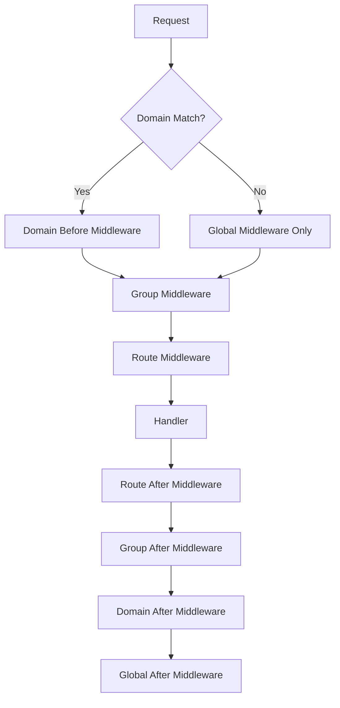
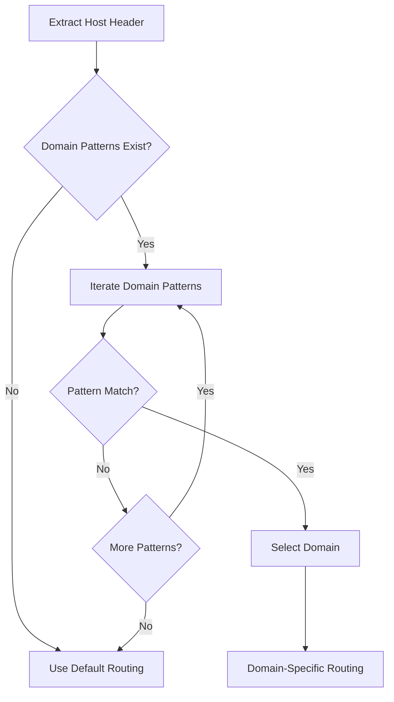

# Domains Module

The domains module provides sophisticated domain-based routing capabilities, allowing different routing configurations based on the request hostname. This is essential for multi-tenant applications, API separation, and microservice architectures.

## Overview

Domain-based routing enables you to define different route sets, middleware, and configuration for different domains, subdomains, or even specific ports. The system supports wildcard matching, port-specific routing, and IPv4/IPv6 addresses.

## Key Features

- **Exact Domain Matching**: Precise hostname matching
- **Wildcard Subdomains**: Support for `*.example.com` patterns
- **Port-Specific Routing**: Different routing for different ports
- **Multiple Patterns**: Single domain can match multiple patterns
- **IPv4/IPv6 Support**: Full support for IP address routing
- **Domain Middleware**: Domain-specific middleware chains
- **Nested Components**: Routes and groups within domains

## Core Interface

### DomainInterface

```go
type DomainInterface interface {
    // Domain patterns
    GetPatterns() []string
    SetPatterns(patterns []string) DomainInterface
    AddPattern(pattern string) DomainInterface
    
    // Route management
    AddRoute(route RouteInterface) DomainInterface
    AddRoutes(routes []RouteInterface) DomainInterface
    GetRoutes() []RouteInterface
    
    // Group management
    AddGroup(group GroupInterface) DomainInterface
    AddGroups(groups []GroupInterface) DomainInterface
    GetGroups() []GroupInterface
    
    // Middleware management
    AddBeforeMiddlewares(middlewares []MiddlewareInterface) DomainInterface
    AddAfterMiddlewares(middlewares []MiddlewareInterface) DomainInterface
    GetBeforeMiddlewares() []MiddlewareInterface
    GetAfterMiddlewares() []MiddlewareInterface
    
    // Domain metadata
    GetName() string
    SetName(name string) DomainInterface
    GetMetadata() map[string]interface{}
    SetMetadata(metadata map[string]interface{}) DomainInterface
    
    // Utility methods
    Matches(host string) bool
    String() string
}
```

## Domain Creation

### Basic Domain Creation

```go
// Single domain pattern
domain := rtr.NewDomain("example.com")
domain.AddRoute(rtr.Get("/", webHomeHandler))
router.AddDomain(domain)
```

### Multiple Patterns

```go
// Domain with multiple patterns
multiDomain := rtr.NewDomain("example.com", "www.example.com", "api.example.com")
multiDomain.AddRoute(rtr.Get("/health", healthHandler))
router.AddDomain(multiDomain)
```

### Method Chaining

```go
apiDomain := rtr.NewDomain("api.example.com").
    SetName("API Domain").
    AddBeforeMiddlewares([]rtr.MiddlewareInterface{
        rtr.NewAnonymousMiddleware(apiKeyMiddleware),
        rtr.NewAnonymousMiddleware(rateLimitMiddleware),
    }).
    AddRoute(rtr.Get("/status", apiStatusHandler)).
    AddRoute(rtr.GetJSON("/users", apiUsersHandler))

router.AddDomain(apiDomain)
```

## Pattern Matching

### Exact Domain Matching

```go
// Matches exactly "example.com"
domain := rtr.NewDomain("example.com")

// Request to "example.com" → matches
// Request to "www.example.com" → doesn't match
// Request to "api.example.com" → doesn't match
```

### Wildcard Subdomains

```go
// Matches any subdomain of example.com
wildcardDomain := rtr.NewDomain("*.example.com")

// Request to "api.example.com" → matches
// Request to "www.example.com" → matches
// Request to "admin.example.com" → matches
// Request to "example.com" → doesn't match (no subdomain)
```

### Port-Specific Matching

```go
// Matches only port 8080
portSpecificDomain := rtr.NewDomain("example.com:8080")

// Request to "example.com:8080" → matches
// Request to "example.com" → doesn't match
// Request to "example.com:3000" → doesn't match
```

### Wildcard Ports

```go
// Matches any port on example.com
wildcardPortDomain := rtr.NewDomain("example.com:*")

// Request to "example.com" → matches
// Request to "example.com:8080" → matches
// Request to "example.com:3000" → matches
```

### IPv4 and IPv6 Addresses

```go
// IPv4 address
ipv4Domain := rtr.NewDomain("127.0.0.1:8080")

// IPv6 address (note square brackets)
ipv6Domain := rtr.NewDomain("[::1]:3000")

// Request to "127.0.0.1:8080" → matches ipv4Domain
// Request to "[::1]:3000" → matches ipv6Domain
```

## Complex Pattern Examples

### Multi-Tenant Architecture

```go
// Tenant-specific domains
tenantDomain := rtr.NewDomain("*.tenant.example.com").
    SetName("Tenant Domain").
    AddBeforeMiddlewares([]rtr.MiddlewareInterface{
        rtr.NewAnonymousMiddleware(tenantAuthMiddleware),
        rtr.NewAnonymousMiddleware(tenantLoggingMiddleware),
    }).
    AddRoute(rtr.Get("/dashboard", tenantDashboardHandler)).
    AddRoute(rtr.Get("/data", tenantDataHandler))

router.AddDomain(tenantDomain)

// Matches: tenant1.example.com, tenant2.example.com, etc.
```

### API and Web Separation

```go
// API domain
apiDomain := rtr.NewDomain("api.example.com").
    SetName("API").
    AddBeforeMiddlewares([]rtr.MiddlewareInterface{
        rtr.NewAnonymousMiddleware(apiKeyMiddleware),
        rtr.NewAnonymousMiddleware(corsMiddleware),
    }).
    AddRoute(rtr.GetJSON("/status", apiStatusHandler)).
    AddRoute(rtr.GetJSON("/users", apiUsersHandler))

// Web domain
webDomain := rtr.NewDomain("www.example.com", "example.com").
    SetName("Web").
    AddRoute(rtr.GetHTML("/", webHomeHandler)).
    AddRoute(rtr.GetHTML("/about", webAboutHandler))

router.AddDomains([]rtr.DomainInterface{apiDomain, webDomain})
```

### Development and Production

```go
// Development domain
devDomain := rtr.NewDomain("localhost", "127.0.0.1", "localhost:*").
    SetName("Development").
    AddRoute(rtr.Get("/debug", debugHandler)).
    AddRoute(rtr.Get("/health", devHealthHandler))

// Production domain
prodDomain := rtr.NewDomain("app.example.com").
    SetName("Production").
    AddBeforeMiddlewares([]rtr.MiddlewareInterface{
        rtr.NewAnonymousMiddleware(prodAuthMiddleware),
        rtr.NewAnonymousMiddleware(prodLoggingMiddleware),
    }).
    AddRoute(rtr.Get("/", prodHomeHandler))

router.AddDomains([]rtr.DomainInterface{devDomain, prodDomain})
```

## Domain Middleware

### Domain-Level Middleware

```go
adminDomain := rtr.NewDomain("admin.example.com").
    SetName("Admin").
    AddBeforeMiddlewares([]rtr.MiddlewareInterface{
        rtr.NewAnonymousMiddleware(adminAuthMiddleware),
        rtr.NewAnonymousMiddleware(adminLoggingMiddleware),
        rtr.NewAnonymousMiddleware(adminSecurityMiddleware),
    }).
    AddAfterMiddlewares([]rtr.MiddlewareInterface{
        rtr.NewAnonymousMiddleware(adminAuditMiddleware),
    }).
    AddRoute(rtr.Get("/dashboard", adminDashboardHandler))

router.AddDomain(adminDomain)
```

### Middleware Execution Order



## Configuration Support

### Declarative Domain Configuration

```go
config := rtr.RouterConfig{
    Domains: []rtr.DomainConfig{
        {
            Patterns: []string{"api.example.com"},
            Name: "API Domain",
            BeforeMiddleware: []rtr.MiddlewareConfig{
                rtr.NewMiddlewareConfig("APIKey", apiKeyMiddleware),
                rtr.NewMiddlewareConfig("CORS", corsMiddleware),
            },
            Routes: []rtr.RouteConfig{
                rtr.GET("/status", apiStatusHandler).WithName("API Status"),
                rtr.GET_JSON("/users", apiUsersHandler).WithName("API Users"),
            },
            Groups: []rtr.GroupConfig{
                rtr.Group("/v1",
                    rtr.GET("/data", v1DataHandler),
                ).WithName("API v1"),
            },
            Metadata: map[string]interface{}{
                "version": "1.0",
                "type": "api",
            },
        },
        {
            Patterns: []string{"www.example.com", "example.com"},
            Name: "Web Domain",
            Routes: []rtr.RouteConfig{
                rtr.GET_HTML("/", webHomeHandler).WithName("Web Home"),
                rtr.GET_HTML("/about", webAboutHandler).WithName("About"),
            },
            Metadata: map[string]interface{}{
                "type": "web",
                "cache": "enabled",
            },
        },
    },
}
```

### Domain Configuration Helper

```go
// Using configuration helpers
apiDomain := rtr.DomainConfig{
    Patterns: []string{"api.example.com"},
    Name: "API",
    BeforeMiddleware: []rtr.MiddlewareConfig{
        rtr.NewMiddlewareConfig("Auth", authMiddleware),
    },
    Routes: []rtr.RouteConfig{
        rtr.GET("/users", usersHandler).WithName("List Users"),
    },
}
```

## Domain Matching Algorithm

### Matching Process



### Matching Logic

1. **Host Extraction**: Extract hostname from `Host` header
2. **Port Handling**: Separate hostname from port if present
3. **Pattern Matching**: Match against domain patterns in order
4. **Selection**: Use first matching domain
5. **Fallback**: Use default routing if no domain matches

### Implementation Example

```go
func (domain *domainImpl) Matches(host string) bool {
    for _, pattern := range domain.patterns {
        if matchDomainPattern(pattern, host) {
            return true
        }
    }
    return false
}

func matchDomainPattern(pattern, host string) bool {
    // Handle exact matches
    if pattern == host {
        return true
    }
    
    // Handle wildcard subdomains
    if strings.HasPrefix(pattern, "*.") {
        baseDomain := strings.TrimPrefix(pattern, "*.")
        return strings.HasSuffix(host, "."+baseDomain) || host == baseDomain
    }
    
    // Handle port-specific patterns
    if strings.Contains(pattern, ":") {
        patternHost, patternPort := splitHostPort(pattern)
        hostHost, hostPort := splitHostPort(host)
        
        if patternPort == "*" {
            return patternHost == hostHost
        }
        
        return pattern == host
    }
    
    return false
}
```

## Use Cases

### Multi-Tenant SaaS

```go
// Tenant domain routing
tenantDomain := rtr.NewDomain("*.app.example.com").
    SetName("Tenant").
    AddBeforeMiddlewares([]rtr.MiddlewareInterface{
        rtr.NewAnonymousMiddleware(tenantIdentificationMiddleware),
        rtr.NewAnonymousMiddleware(tenantAuthMiddleware),
    }).
    AddRoute(rtr.Get("/", tenantDashboardHandler)).
    AddRoute(rtr.Get("/settings", tenantSettingsHandler))

// Admin domain
adminDomain := rtr.NewDomain("admin.app.example.com").
    SetName("Admin").
    AddBeforeMiddlewares([]rtr.MiddlewareInterface{
        rtr.NewAnonymousMiddleware(adminAuthMiddleware),
    }).
    AddRoute(rtr.Get("/", adminDashboardHandler))

router.AddDomains([]rtr.DomainInterface{tenantDomain, adminDomain})
```

### API Versioning by Domain

```go
// Version 1 API
v1Domain := rtr.NewDomain("api-v1.example.com").
    SetName("API v1").
    AddRoute(rtr.GetJSON("/users", v1UsersHandler))

// Version 2 API
v2Domain := rtr.NewDomain("api-v2.example.com").
    SetName("API v2").
    AddRoute(rtr.GetJSON("/users", v2UsersHandler))

// Current API
currentDomain := rtr.NewDomain("api.example.com").
    SetName("Current API").
    AddRoute(rtr.GetJSON("/users", currentUsersHandler))

router.AddDomains([]rtr.DomainInterface{v1Domain, v2Domain, currentDomain})
```

### Microservice Separation

```go
// User service
userServiceDomain := rtr.NewDomain("users.example.com").
    SetName("User Service").
    AddRoute(rtr.GetJSON("/users/:id", userHandler)).
    AddRoute(rtr.PostJSON("/users", createUserHandler))

// Product service
productServiceDomain := rtr.NewDomain("products.example.com").
    SetName("Product Service").
    AddRoute(rtr.GetJSON("/products/:id", productHandler)).
    AddRoute(rt.PostJSON("/products", createProductHandler))

// Order service
orderServiceDomain := rtr.NewDomain("orders.example.com").
    SetName("Order Service").
    AddRoute(rtr.GetJSON("/orders/:id", orderHandler)).
    AddRoute(rtr.PostJSON("/orders", createOrderHandler))

router.AddDomains([]rtr.DomainInterface{
    userServiceDomain,
    productServiceDomain,
    orderServiceDomain,
})
```

## Testing Domains

### Unit Testing Domain Matching

```go
func TestDomainMatching(t *testing.T) {
    tests := []struct {
        name     string
        pattern  string
        host     string
        expected bool
    }{
        {"exact match", "example.com", "example.com", true},
        {"exact mismatch", "example.com", "www.example.com", false},
        {"wildcard match", "*.example.com", "api.example.com", true},
        {"wildcard no subdomain", "*.example.com", "example.com", false},
        {"port specific", "example.com:8080", "example.com:8080", true},
        {"port mismatch", "example.com:8080", "example.com:3000", false},
        {"wildcard port", "example.com:*", "example.com:8080", true},
    }
    
    for _, tt := range tests {
        t.Run(tt.name, func(t *testing.T) {
            domain := rtr.NewDomain(tt.pattern)
            assert.Equal(t, tt.expected, domain.Matches(tt.host))
        })
    }
}
```

### Integration Testing Domain Routing

```go
func TestDomainRouting(t *testing.T) {
    router := rtr.NewRouter()
    
    // API domain
    apiDomain := rtr.NewDomain("api.example.com")
    apiDomain.AddRoute(rtr.GetJSON("/status", func(w http.ResponseWriter, r *http.Request) string {
        return `{"service": "api"}`
    }))
    router.AddDomain(apiDomain)
    
    // Web domain
    webDomain := rtr.NewDomain("www.example.com")
    webDomain.AddRoute(rtr.Get("/", func(w http.ResponseWriter, r *http.Request) {
        w.Write([]byte("web home"))
    }))
    router.AddDomain(webDomain)
    
    // Test API domain
    req := httptest.NewRequest("GET", "/status", nil)
    req.Host = "api.example.com"
    w := httptest.NewRecorder()
    router.ServeHTTP(w, req)
    
    assert.Equal(t, http.StatusOK, w.Code)
    assert.Equal(t, "application/json", w.Header().Get("Content-Type"))
    assert.Contains(t, w.Body.String(), `"service": "api"`)
    
    // Test web domain
    req = httptest.NewRequest("GET", "/", nil)
    req.Host = "www.example.com"
    w = httptest.NewRecorder()
    router.ServeHTTP(w, req)
    
    assert.Equal(t, http.StatusOK, w.Code)
    assert.Equal(t, "web home", w.Body.String())
}
```

## Performance Considerations

### Domain Matching Optimization

- **Order Matters**: More specific patterns should come first
- **Pattern Complexity**: Wildcard patterns are more expensive than exact matches
- **Caching**: Consider caching domain matches for high-traffic applications

```go
// Good: Specific patterns first
router.AddDomain(rtr.NewDomain("api.example.com"))        // Exact match
router.AddDomain(rtr.NewDomain("*.example.com"))          // Wildcard

// Avoid: Wildcard patterns first (less efficient)
router.AddDomain(rtr.NewDomain("*.example.com"))          // Wildcard
router.AddDomain(rtr.NewDomain("api.example.com"))        // Exact match
```

### Memory Usage

- **Pattern Storage**: Domain patterns are stored as strings
- **Matching State**: Minimal state during matching
- **Middleware Storage**: Domain middleware is stored per domain

## Best Practices

### 1. Use Specific Patterns First

```go
// Good: Specific patterns before wildcards
router.AddDomain(rtr.NewDomain("api.example.com"))
router.AddDomain(rtr.NewDomain("admin.example.com"))
router.AddDomain(rtr.NewDomain("*.example.com"))

// Avoid: Wildcards first
router.AddDomain(rtr.NewDomain("*.example.com"))
router.AddDomain(rtr.NewDomain("api.example.com"))
```

### 2. Group Related Domains

```go
// Good: Logical grouping
apiDomains := []rtr.DomainInterface{
    rtr.NewDomain("api.example.com"),
    rtr.NewDomain("api-v1.example.com"),
    rtr.NewDomain("api-v2.example.com"),
}
router.AddDomains(apiDomains)
```

### 3. Use Descriptive Names

```go
// Good: Descriptive domain names
apiDomain := rtr.NewDomain("api.example.com").SetName("Production API")
devDomain := rtr.NewDomain("api-dev.example.com").SetName("Development API")
testDomain := rtr.NewDomain("api-test.example.com").SetName("Testing API")
```

### 4. Leverage Domain Middleware

```go
// Good: Domain-specific middleware
apiDomain := rtr.NewDomain("api.example.com").
    AddBeforeMiddlewares([]rtr.MiddlewareInterface{
        rtr.NewAnonymousMiddleware(apiKeyMiddleware),
        rtr.NewAnonymousMiddleware(rateLimitMiddleware),
    })

// Avoid: Duplicating middleware on each route
```

### 5. Plan for Scalability

```go
// Good: Structure for multiple environments
prodDomain := rtr.NewDomain("app.example.com")
stagingDomain := rtr.NewDomain("staging.example.com")
devDomain := rtr.NewDomain("dev.example.com")

// Easy to add new environments
qaDomain := rtr.NewDomain("qa.example.com")
router.AddDomain(qaDomain)
```

## See Also

- [Router Core Module](router_core.md) - Main router component
- [Routes Module](routes.md) - Route management and matching
- [Groups Module](groups.md) - Route grouping and organization
- [Middleware Module](middleware.md) - Middleware system
- [API Reference](../api_reference.md) - Complete API documentation
