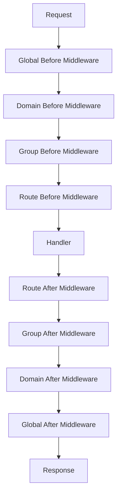

# Middleware Module

The middleware module provides a flexible and powerful system for request processing, allowing you to inject logic at various points in the request lifecycle.

## Overview

Middleware functions are executed in a chain before and after the main handler, enabling cross-cutting concerns like authentication, logging, error handling, and request modification.

## Key Features

- **Before/After Execution**: Separate middleware chains for pre and post-processing
- **Multiple Levels**: Apply middleware at router, domain, group, and route levels
- **Named Middleware**: Metadata-rich middleware for debugging and documentation
- **Standard Compatibility**: Works with standard Go middleware patterns
- **Flexible Composition**: Easy to combine and chain middleware

## Middleware Types

### StdMiddleware

Standard middleware following the Go HTTP pattern:

```go
type StdMiddleware func(http.Handler) http.Handler
```

**Example:**
```go
func loggingMiddleware(next http.Handler) http.Handler {
    return http.HandlerFunc(func(w http.ResponseWriter, r *http.Request) {
        start := time.Now()
        log.Printf("Request started: %s %s", r.Method, r.URL.Path)
        
        next.ServeHTTP(w, r)
        
        duration := time.Since(start)
        log.Printf("Request completed: %s %s in %v", r.Method, r.URL.Path, duration)
    })
}
```

### MiddlewareInterface

Named middleware with metadata and debugging capabilities:

```go
type MiddlewareInterface interface {
    GetName() string
    SetName(name string) MiddlewareInterface
    GetHandler() StdMiddleware
    SetHandler(handler StdMiddleware) MiddlewareInterface
    Execute(next http.Handler) http.Handler
}
```

**Example:**
```go
// Create named middleware
authMiddleware := rtr.NewMiddleware("Authentication", authHandler)

// Create anonymous middleware
loggingMiddleware := rtr.NewAnonymousMiddleware(loggingHandler)
```

## Execution Order

### Middleware Chain Flow



### Execution Sequence

1. **Global Before Middleware**: Router-level pre-processing
2. **Domain Before Middleware**: Domain-specific pre-processing
3. **Group Before Middleware**: Group-specific pre-processing
4. **Route Before Middleware**: Route-specific pre-processing
5. **Handler Execution**: Main route handler
6. **Route After Middleware**: Route-specific post-processing
7. **Group After Middleware**: Group-specific post-processing
8. **Domain After Middleware**: Domain-specific post-processing
9. **Global After Middleware**: Router-level post-processing

## Creating Middleware

### Basic Middleware

```go
func basicMiddleware(next http.Handler) http.Handler {
    return http.HandlerFunc(func(w http.ResponseWriter, r *http.Request) {
        // Pre-processing logic
        log.Printf("Processing request: %s %s", r.Method, r.URL.Path)
        
        // Call next handler
        next.ServeHTTP(w, r)
        
        // Post-processing logic
        log.Printf("Completed request: %s %s", r.Method, r.URL.Path)
    })
}
```

### Authentication Middleware

```go
func authMiddleware(next http.Handler) http.Handler {
    return http.HandlerFunc(func(w http.ResponseWriter, r *http.Request) {
        token := r.Header.Get("Authorization")
        if token == "" {
            http.Error(w, "Authorization header required", http.StatusUnauthorized)
            return
        }
        
        // Validate token
        user, err := validateToken(token)
        if err != nil {
            http.ErrorPkg.Error caller.Error(w,. "Invalid; Invalid token",; http.StatusUnauthorized; Unauthorized)
; return
; }
        
  ;        //ist.AddToContext
        context.WithValue(r.Context(), "user", user)
        r = r.WithContext(ctx)
        
        next.ServeHTTP(w, r)
    })
}
```

### Rate Limiting Middleware

```go
func rateLimitMiddleware(requests int, window time.Duration) StdMiddleware {
    limiter := rate.NewLimiter(rate.Limit(requests), requests)
    
    return func(next http.Handler) http.Handler {
        return http.HandlerFunc(func(w http.ResponseWriter, r *http.Request) {
            if !limiter.Allow() {
                http.Error(w, "Rate limit exceeded", http.StatusTooManyRequests)
                return
            }
            
            next.ServeHTTP(w, r)
        })
    }
}
```

### CORS Middleware

```go
func corsMiddleware(next http.Handler) http.Handler {
    return http.HandlerFunc(func(w http.ResponseWriter, r *http.Request) {
        w.Header().Set("Access-Control-Allow-Origin", "*")
        w.Header().Set("Access-Control-Allow-Methods", "GET, POST, PUT, DELETE, OPTIONS")
        w.Header().Set("Access-Control-Allow-Headers", "Content-Type, Authorization")
        
        if r.Method == "OPTIONS" {
            w.WriteHeader(http.StatusOK)
            return
        }
        
        next.ServeHTTP(w, r)
    })
}
```

### Recovery Middleware

```go
func recoveryMiddleware(next http.Handler) http.Handler {
    return http.HandlerFunc(func(w http.ResponseWriter, r *http.Request) {
        defer func() {
            if err := recover(); err != nil {
                log.Printf("Panic recovered: %v", err)
                http.Error(w, "Internal Server Error", http.StatusInternalServerError)
            }
        }()
        
        next.ServeHTTP(w, r)
    })
}
```

## Middleware Management

### Adding Middleware

#### Global Middleware

```go
router := rtr.NewRouter()

// Before middleware
router.AddBeforeMiddlewares([]rtr.MiddlewareInterface{
    rtr.NewMiddleware("Recovery", recoveryMiddleware),
    rtr.NewMiddleware("CORS", corsMiddleware),
    rtr.NewAnonymousMiddleware(loggingMiddleware),
})

// After middleware
router.AddAfterMiddlewares([]rtr.MiddlewareInterface{
    rtr.NewMiddleware("ResponseTime", responseTimeMiddleware),
})
```

#### Group Middleware

```go
apiGroup := rtr.NewGroup().SetPrefix("/api/v1")
apiGroup.AddBeforeMiddlewares([]rtr.MiddlewareInterface{
    rtr.NewMiddleware("APIKey", apiKeyMiddleware),
    rtr.NewMiddleware("RateLimit", rateLimitMiddleware),
})
router.AddGroup(apiGroup)
```

#### Route Middleware

```go
router.AddRoute(rtr.Get("/admin", adminHandler).
    AddBeforeMiddlewares([]rtr.MiddlewareInterface{
        rtr.NewMiddleware("AdminAuth", adminAuthMiddleware),
    }))
```

#### Domain Middleware

```go
adminDomain := rtr.NewDomain("admin.example.com")
adminDomain.AddBeforeMiddlewares([]rtr.MiddlewareInterface{
    rtr.NewMiddleware("AdminLogging", adminLoggingMiddleware),
})
router.AddDomain(adminDomain)
```

### Middleware Conversion

#### Converting StdMiddleware to MiddlewareInterface

```go
// Anonymous middleware
anonymous := rtr.NewAnonymousMiddleware(stdMiddleware)

// Named middleware
named := rtr.NewMiddleware("Logger", stdMiddleware)
```

#### Converting Slices

```go
// Convert slice of StdMiddleware to MiddlewareInterface
stdMiddlewares := []rtr.StdMiddleware{loggingMiddleware, authMiddleware}
interfaces := rtr.MiddlewaresToInterfaces(stdMiddlewares)

// Convert back
stdMiddlewares = rtr.InterfacesToMiddlewares(interfaces)
```

## Built-in Middleware

RTR provides several built-in middleware components in the `middlewares` package:

### Recovery Middleware
```go
import "github.com/dracory/rtr/middlewares"

router.AddBeforeMiddlewares([]rtr.MiddlewareInterface{
    rtr.NewAnonymousMiddleware(middlewares.RecoveryMiddleware),
})
```

### CORS Middleware
```go
router.AddBeforeMiddlewares([]rtr.MiddlewareInterface{
    rtr.NewAnonymousMiddleware(middlewares.CorsMiddleware),
})
```

### Rate Limiting Middleware
```go
router.AddBeforeMiddlewares([]rtr.MiddlewareInterface{
    rtr.NewAnonymousMiddleware(middlewares.RateLimitByIPMiddleware),
})
```

### Logger Middleware
```go
router.AddBeforeMiddlewares([]rtr.MiddlewareInterface{
    rtr.NewAnonymousMiddleware(middlewares.LoggerMiddleware),
})
```

### Request ID Middleware
```go
router.AddBeforeMiddlewares([]rtr.MiddlewareInterface{
    rtr.NewAnonymousMiddleware(middlewares.RequestIDMiddleware),
})
```

## Advanced Middleware Patterns

### Conditional Middleware

```go
func conditionalMiddleware(condition func(*http.Request) bool, middleware StdMiddleware) StdMiddleware {
    return func(next http.Handler) http.Handler {
        return http.HandlerFunc(func(w http.ResponseWriter, r *http.Request) {
            if condition(r) {
                middleware(next).ServeHTTP(w, r)
            } else {
                next.ServeHTTP(w, r)
            }
        })
    }
}

// Usage
router.AddBeforeMiddlewares([]rtr.MiddlewareInterface{
    rtr.NewAnonymousMiddleware(conditionalMiddleware(
        func(r *http.Request) bool {
            return strings.HasPrefix(r.URL.Path, "/api/")
        },
        apiMiddleware,
    )),
})
```

### Middleware Composition

```go
func composeMiddleware(middlewares ...StdMiddleware) StdMiddleware {
    return func(final http.Handler) http.Handler {
        for i := len(middlewares) - 1; i >= 0; i-- {
            final = middlewares[i](final)
        }
        return final
    }
}

// Usage
chain := composeMiddleware(loggingMiddleware, authMiddleware, corsMiddleware)
router.AddBeforeMiddlewares([]rtr.MiddlewareInterface{
    rtr.NewAnonymousMiddleware(chain),
})
```

### Context Middleware

```go
func contextMiddleware(key, value string) StdMiddleware {
    return func(next http.Handler) http.Handler {
        return http.HandlerFunc(func(w http.ResponseWriter, r *http.Request) {
            ctx := context.WithValue(r.Context(), key, value)
            next.ServeHTTP(w, r.WithContext(ctx))
        })
    }
}

// Usage
router.AddBeforeMiddlewares([]rtr.MiddlewareInterface{
    rtr.NewAnonymousMiddleware(contextMiddleware("requestID", generateRequestID())),
})
```

### Metrics Middleware

```go
func metricsMiddleware(next http.Handler) http.Handler {
    return http.HandlerFunc(func(w http.ResponseWriter, r *http.Request) {
        start := time.Now()
        
        // Wrap response writer to capture status code
        rw := &responseWriter{ResponseWriter: w, statusCode: 200}
        
        next.ServeHTTP(rw, r)
        
        duration := time.Since(start)
        
        // Record metrics
        recordMetric(r.Method, r.URL.Path, rw.statusCode, duration)
    })
}

type responseWriter struct {
    http.ResponseWriter
    statusCode int
}

func (rw *responseWriter) WriteHeader(code int) {
    rw.statusCode = code
    rw.ResponseWriter.WriteHeader(code)
}
```

## Configuration Support

### Declarative Middleware Configuration

```go
config := rtr.RouterConfig{
    BeforeMiddleware: []rtr.MiddlewareConfig{
        rtr.NewMiddlewareConfig("Recovery", middlewares.RecoveryMiddleware),
        rtr.NewMiddlewareConfig("CORS", middlewares.CorsMiddleware),
        rtr.NewMiddlewareConfig("Logger", loggingMiddleware),
    },
    Routes: []rtr.RouteConfig{
        rtr.GET("/api/users", usersHandler).
            WithBeforeMiddleware(
                rtr.NewAnonymousMiddleware(authMiddleware),
                rtr.NewAnonymousMiddleware(rateLimitMiddleware),
            ),
    },
    Groups: []rtr.GroupConfig{
        rtr.Group("/admin",
            rtr.GET("/dashboard", adminDashboardHandler),
        ).
        WithBeforeMiddleware(
            rtr.NewAnonymousMiddleware(adminAuthMiddleware),
        ),
    },
}
```

### Middleware Configuration with Metadata

```go
middlewareConfig := rtr.MiddlewareConfig{
    Name: "RateLimit",
    Handler: rateLimitMiddleware,
    Metadata: map[string]interface{}{
        "requests": 100,
        "window":   "1m",
    },
}
```

## Testing Middleware

### Unit Testing Middleware

```go
func TestAuthMiddleware(t *testing.T) {
    middleware := authMiddleware
    
    // Test with valid token
    req := httptest.NewRequest("GET", "/test", nil)
    req.Header.Set("Authorization", "valid-token")
    w := httptest.NewRecorder()
    
    handler := middleware(http.HandlerFunc(func(w http.ResponseWriter, r *http.Request) {
        w.WriteHeader(http.StatusOK)
    }))
    
    handler.ServeHTTP(w, req)
    
    assert.Equal(t, http.StatusOK, w.Code)
    
    // Test without token
    req = httptest.NewRequest("GET", "/test", nil)
    w = httptest.NewRecorder()
    
    handler.ServeHTTP(w, req)
    
    assert.Equal(t, http.StatusUnauthorized, w.Code)
}
```

### Integration Testing Middleware

```go
func TestMiddlewareChain(t *testing.T) {
    router := rtr.NewRouter()
    
    // Add middleware
    router.AddBeforeMiddlewares([]rtr.MiddlewareInterface{
        rtr.NewAnonymousMiddleware(loggingMiddleware),
        rtr.NewAnonymousMiddleware(authMiddleware),
    })
    
    // Add route
    router.AddRoute(rtr.Get("/protected", func(w http.ResponseWriter, r *http.Request) {
        w.Write([]byte("protected content"))
    }))
    
    // Test request
    req := httptest.NewRequest("GET", "/protected", nil)
    req.Header.Set("Authorization", "valid-token")
    w := httptest.NewRecorder()
    
    router.ServeHTTP(w, req)
    
    assert.Equal(t, http.StatusOK, w.Code)
    assert.Equal(t, "protected content", w.Body.String())
}
```

## Debugging Middleware

### Middleware Tracing

```go
func debugMiddleware(name string) StdMiddleware {
    return func(next http.Handler) http.Handler {
        return http.HandlerFunc(func(w http.ResponseWriter, r *http.Request) {
            fmt.Printf("→ Entering middleware: %s\n", name)
            start := time.Now()
            
            next.ServeHTTP(w, r)
            
            duration := time.Since(start)
            fmt.Printf("← Exiting middleware: %s (took %v)\n", name, duration)
        })
    }
}

// Usage
router.AddBeforeMiddlewares([]rtr.MiddlewareInterface{
    rtr.NewAnonymousMiddleware(debugMiddleware("global-1")),
    rtr.NewAnonymousMiddleware(debugMiddleware("global-2")),
})
```

### Request State Inspection

```go
func inspectionMiddleware(next http.Handler) http.Handler {
    return http.HandlerFunc(func(w http.ResponseWriter, r *http.Request) {
        fmt.Printf("Request details:\n")
        fmt.Printf("  Method: %s\n", r.Method)
        fmt.Printf("  Path: %s\n", r.URL.Path)
        fmt.Printf("  Headers: %+v\n", r.Header)
        fmt.Printf("  Context values: %+v\n", r.Context())
        
        next.ServeHTTP(w, r)
    })
}
```

## Performance Considerations

### Efficient Middleware Design

```go
// Good: Minimal allocations
func efficientMiddleware(next http.Handler) http.Handler {
    return http.HandlerFunc(func(w http.ResponseWriter, r *http.Request) {
        // Fast path
        if r.URL.Path == "/health" {
            w.WriteHeader(http.StatusOK)
            return
        }
        
        next.ServeHTTP(w, r)
    })
}

// Avoid: Unnecessary allocations
func inefficientMiddleware(next http.Handler) http.Handler {
    return http.HandlerFunc(func(w http.ResponseWriter, r *http.Request) {
        // Creating unnecessary strings
        path := r.URL.Path
        method := r.Method
        combined := method + " " + path
        
        log.Printf("Request: %s", combined)
        
        next.ServeHTTP(w, r)
    })
}
```

### Middleware Ordering

Place expensive middleware later in the chain:

```go
router.AddBeforeMiddlewares([]rtr.MiddlewareInterface{
    // Fast middleware first
    rtr.NewAnonymousMiddleware(corsMiddleware),
    rtr.NewAnonymousMiddleware(requestIDMiddleware),
    
    // Expensive middleware last
    rtr.NewAnonymousMiddleware(authMiddleware),
    rtr.NewAnonymousMiddleware(rateLimitMiddleware),
})
```

## Best Practices

### 1. Use Named Middleware for Debugging

```go
// Good: Named middleware
rtr.NewMiddleware("Authentication", authMiddleware)

// Acceptable: Anonymous middleware
rtr.NewAnonymousMiddleware(authMiddleware)
```

### 2. Keep Middleware Focused

```go
// Good: Single responsibility
func authMiddleware(next http.Handler) http.Handler { /* auth only */ }
func loggingMiddleware(next http.Handler) http.Handler { /* logging only */ }

// Avoid: Multiple responsibilities
func authAndLoggingMiddleware(next http.Handler) http.Handler { /* both */ }
```

### 3. Handle Errors Gracefully

```go
func robustMiddleware(next http.Handler) http.Handler {
    return http.HandlerFunc(func(w http.ResponseWriter, r *http.Request) {
        defer func() {
            if err := recover(); err != nil {
                log.Printf("Middleware panic: %v", err)
                http.Error(w, "Internal Server Error", http.StatusInternalServerError)
            }
        }()
        
        next.ServeHTTP(w, r)
    })
}
```

### 4. Use Context for Request Data

```go
func contextMiddleware(next http.Handler) http.Handler {
    return http.HandlerFunc(func(w http.ResponseWriter, r *http.Request) {
        ctx := context.WithValue(r.Context(), "userID", "12345")
        next.ServeHTTP(w, r.WithContext(ctx))
    })
}
```

## See Also

- [Router Core Module](router_core.md) - Main router component
- [Built-in Middleware](../builtin-middleware.md) - Available middleware components
- [Handlers Module](handlers.md) - Handler types and execution
- [API Reference](../api_reference.md) - Complete API documentation
