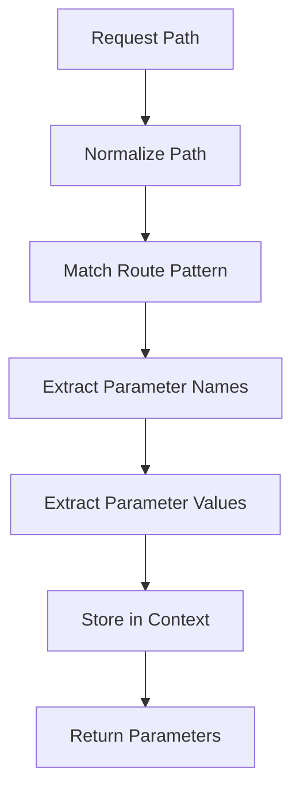

# Parameters Module

The parameters module provides sophisticated path parameter extraction, validation, and management capabilities for dynamic routing in the RTR router system.

## Overview

Path parameters allow you to create dynamic routes that capture values from the URL path. RTR supports multiple parameter types including required, optional, and greedy parameters with flexible syntax options.

## Parameter Types

### Required Parameters

Parameters that must be present in the request path:

```go
// Colon syntax
router.AddRoute(rtr.Get("/users/:id", handler))

// Brace syntax (equivalent)
router.AddRoute(rtr.Get("/users/{id}", handler))
```

**Examples:**
- `/users/123` → `id = "123"`
- `/users/john` → `id = "john"`
- `/users/` → 404 (parameter missing)

### Optional Parameters

Parameters that may be omitted from the request path:

```go
// Colon syntax with question mark
router.AddRoute(rtr.Get("/articles/:category/:id?", handler))

// Brace syntax with question mark (equivalent)
router.AddRoute(rtr.Get("/articles/{category}/{id?}", handler))
```

**Examples:**
- `/articles/tech/123` → `category = "tech", id = "123"`
- `/articles/tech` → `category = "tech", id = "" (exists = false)`
- `/articles/` → 404 (category missing)

### Greedy Parameters

Parameters that capture the remainder of the path (must be the last segment):

```go
// Colon syntax with ellipsis
router.AddRoute(rtr.Get("/files/:path...", handler))

// Brace syntax with ellipsis (equivalent)
router.AddRoute(rtr.Get("/files/{path...}", handler))
```

**Examples:**
- `/files/images/photo.jpg` → `path = "images/photo.jpg"`
- `/files/user/docs/report.pdf` → `path = "user/docs/report.pdf"`
- `/files/` → `path = ""` (empty but exists)

### Wildcard Routes

Non-capturing catch-all routes (use greedy parameter for capturing):

```go
// Wildcard (non-capturing)
router.AddRoute(rtr.Get("/static/*", handler))

// Greedy parameter (capturing)
router.AddRoute(rtr.Get("/static/:path...", handler))
```

## Parameter Functions

### GetParam

Safely gets a path parameter with existence check:

```go
func GetParam(r *http.Request, key string) (string, bool)
```

**Example:**
```go
func handler(w http.ResponseWriter, r *http.Request) {
    if userID, exists := rtr.GetParam(r, "id"); exists {
        fmt.Fprintf(w, "User ID: %s", userID)
    } else {
        fmt.Fprint(w, "No user ID provided")
    }
}
```

### MustGetParam

Gets a required parameter (panics if not found):

```go
func MustGetParam(r *http.Request, key string) string
```

**Example:**
```go
func handler(w http.ResponseWriter, r *http.Request) {
    userID := rtr.MustGetParam(r, "id") // Panics if "id" doesn't exist
    fmt.Fprintf(w, "User ID: %s", userID)
}
```

### GetParams

Returns all path parameters as a map:

```go
func GetParams(r *http.Request) map[string]string
```

**Example:**
```go
func handler(w http.ResponseWriter, r *http.Request) {
    params := rtr.GetParams(r)
    for key, value := range params {
        fmt.Fprintf(w, "%s = %s\n", key, value)
    }
}
```

### SetParam

Sets a path parameter (primarily for testing):

```go
func SetParam(r *http.Request, key, value string)
```

**Example:**
```go
func TestHandler(t *testing.T) {
    req := httptest.NewRequest("GET", "/users/123", nil)
    rtr.SetParam(req, "id", "123")
    
    // Test handler
    handler(w, req)
}
```

## Pattern Syntax

### Colon Syntax (Primary)

```go
/users/:id                    // Required parameter
/users/:id?                   // Optional parameter
/files/:path...               // Greedy parameter
```

### Brace Syntax (Alternative)

```go
/users/{id}                   // Required parameter
/users/{id?}                  // Optional parameter
/files/{path...}              // Greedy parameter
```

### Mixed Syntax

Both syntaxes can be used in the same route:

```go
/users/:id/posts/{post_id?}   // Mixed colon and brace
```

### Regex Patterns (Normalization)

Inline regex patterns are normalized (parameter name retained, regex ignored):

```go
/users/{id:[0-9]+}            // Normalized to :id
/posts/{slug:[a-z-]+}         // Normalized to :slug
```

## Parameter Extraction

### Extraction Algorithm



### Extraction Process

1. **Path Normalization**: Remove query strings, handle trailing slashes
2. **Pattern Matching**: Match against route pattern
3. **Parameter Identification**: Extract parameter names from pattern
4. **Value Extraction**: Extract corresponding values from path
5. **Context Storage**: Store parameters in request context
6. **Return Values**: Provide access functions

### Implementation Example

```go
func extractParameters(pattern, path string) map[string]string {
    params := make(map[string]string)
    
    // Split pattern and path into segments
    patternSegments := strings.Split(pattern, "/")
    pathSegments := strings.Split(path, "/")
    
    for i, patternSeg := range patternSegments {
        if i >= len(pathSegments) {
            break
        }
        
        // Check if segment is a parameter
        if strings.HasPrefix(patternSeg, ":") || strings.HasPrefix(patternSeg, "{") {
            paramName := extractParameterName(patternSeg)
            params[paramName] = pathSegments[i]
        }
    }
    
    return params
}
```

## Advanced Patterns

### Complex Route Examples

```go
// User resource with optional action
router.AddRoute(rtr.Get("/users/:id/:action?", func(w http.ResponseWriter, r *http.Request) {
    userID := rtr.MustGetParam(r, "id")
    action, hasAction := rtr.GetParam(r, "action")
    
    if hasAction {
        fmt.Fprintf(w, "User %s: %s", userID, action)
    } else {
        fmt.Fprintf(w, "User %s profile", userID)
    }
}))

// File serving with path and extension
router.AddRoute(rtr.Get("/files/:ext/:size/:path...", func(w http.ResponseWriter, r *http.Request) {
    ext := rtr.MustGetParam(r, "ext")
    size := rtr.MustGetParam(r, "size")
    path := rtr.MustGetParam(r, "path")
    
    fmt.Fprintf(w, "File: %s.%s (size: %s)", path, ext, size)
}))

// API versioning with resource and ID
router.AddRoute(rtr.Get("/api/v:version/:resource/:id?", func(w http.ResponseWriter, r *http.Request) {
    version := rtr.MustGetParam(r, "version")
    resource := rtr.MustGetParam(r, "resource")
    id, hasID := rtr.GetParam(r, "id")
    
    if hasID {
        fmt.Fprintf(w, "API v%s %s: %s", version, resource, id)
    } else {
        fmt.Fprintf(w, "API v%s %s list", version, resource)
    }
}))
```

### Multi-level Paths

```go
// Nested resource paths
router.AddRoute(rtr.Get("/orgs/:org_id/users/:user_id/posts/:post_id", func(w http.ResponseWriter, r *http.Request) {
    orgID := rtr.MustGetParam(r, "org_id")
    userID := rtr.MustGetParam(r, "user_id")
    postID := rtr.MustGetParam(r, "post_id")
    
    fmt.Fprintf(w, "Org: %s, User: %s, Post: %s", orgID, userID, postID)
}))

// Category hierarchy with greedy capture
router.AddRoute(rtr.Get("/categories/:category...", func(w http.ResponseWriter, r *http.Request) {
    categoryPath := rtr.MustGetParam(r, "category")
    categories := strings.Split(categoryPath, "/")
    
    fmt.Fprintf(w, "Category path: %v", categories)
}))
```

## Parameter Validation

### Custom Validation

```go
func validateUUID(id string) bool {
    pattern := `^[a-fA-F0-9]{8}-[a-fA-F0-9]{4}-[a-fA-F0-9]{4}-[a-fA-F0-9]{4}-[a-fA-F0-9]{12}$`
    matched, _ := regexp.MatchString(pattern, id)
    return matched
}

func userHandler(w http.ResponseWriter, r *http.Request) {
    userID := rtr.MustGetParam(r, "id")
    
    if !validateUUID(userID) {
        http.Error(w, "Invalid user ID format", http.StatusBadRequest)
        return
    }
    
    // Continue with valid ID
    user := getUserByID(userID)
    fmt.Fprintf(w, "User: %s", user.Name)
}

router.AddRoute(rtr.Get("/users/:id", userHandler))
```

### Type Conversion

```go
func getIntParam(r *http.Request, key string) (int, error) {
    value := rtr.MustGetParam(r, key)
    return strconv.Atoi(value)
}

func getStringParam(r *http.Request, key string) string {
    return rtr.MustGetParam(r, key)
}

func productHandler(w http.ResponseWriter, r *http.Request) {
    productID, err := getIntParam(r, "id")
    if err != nil {
        http.Error(w, "Invalid product ID", http.StatusBadRequest)
        return
    }
    
    product := getProductByID(productID)
    fmt.Fprintf(w, "Product: %s", product.Name)
}

router.AddRoute(rtr.Get("/products/:id", productHandler))
```

### Validation Middleware

```go
func validationMiddleware(validationRules map[string]func(string) bool) StdMiddleware {
    return func(next http.Handler) http.Handler {
        return http.HandlerFunc(func(w http.ResponseWriter, r *http.Request) {
            params := rtr.GetParams(r)
            
            for param, validator := range validationRules {
                if value, exists := params[param]; exists {
                    if !validator(value) {
                        http.Error(w, fmt.Sprintf("Invalid %s", param), http.StatusBadRequest)
                        return
                    }
                }
            }
            
            next.ServeHTTP(w, r)
        })
    }
}

// Usage
router.AddRoute(rtr.Get("/users/:id", userHandler).
    AddBeforeMiddlewares([]rtr.MiddlewareInterface{
        rtr.NewAnonymousMiddleware(validationMiddleware(map[string]func(string) bool{
            "id": validateUUID,
        })),
    }))
```

## Testing Parameters

### Unit Testing Parameter Extraction

```go
func TestParameterExtraction(t *testing.T) {
    tests := []struct {
        name         string
        pattern      string
        path         string
        expected     map[string]string
        shouldMatch  bool
    }{
        {
            name:        "required parameter",
            pattern:     "/users/:id",
            path:        "/users/123",
            expected:    map[string]string{"id": "123"},
            shouldMatch: true,
        },
        {
            name:        "optional parameter present",
            pattern:     "/articles/:category/:id?",
            path:        "/articles/tech/123",
            expected:    map[string]string{"category": "tech", "id": "123"},
            shouldMatch: true,
        },
        {
            name:        "optional parameter missing",
            pattern:     "/articles/:category/:id?",
            path:        "/articles/tech",
            expected:    map[string]string{"category": "tech"},
            shouldMatch: true,
        },
        {
            name:        "greedy parameter",
            pattern:     "/files/:path...",
            path:        "/files/images/photo.jpg",
            expected:    map[string]string{"path": "images/photo.jpg"},
            shouldMatch: true,
        },
    }
    
    for _, tt := range tests {
        t.Run(tt.name, func(t *testing.T) {
            params, matched := extractParameters(tt.pattern, tt.path)
            
            assert.Equal(t, tt.shouldMatch, matched)
            if tt.shouldMatch {
                assert.Equal(t, tt.expected, params)
            }
        })
    }
}
```

### Integration Testing Parameters

```go
func TestParameterIntegration(t *testing.T) {
    router := rtr.NewRouter()
    
    router.AddRoute(rtr.Get("/users/:id", func(w http.ResponseWriter, r *http.Request) {
        userID := rtr.MustGetParam(r, "id")
        fmt.Fprintf(w, "User ID: %s", userID)
    }))
    
    tests := []struct {
        path         string
        expectedBody string
        expectedCode int
    }{
        {"/users/123", "User ID: 123", http.StatusOK},
        {"/users/john", "User ID: john", http.StatusOK},
        {"/users/", "", http.StatusNotFound}, // Missing parameter
    }
    
    for _, tt := range tests {
        t.Run(tt.path, func(t *testing.T) {
            req := httptest.NewRequest("GET", tt.path, nil)
            w := httptest.NewRecorder()
            
            router.ServeHTTP(w, req)
            
            assert.Equal(t, tt.expectedCode, w.Code)
            assert.Equal(t, tt.expectedBody, w.Body.String())
        })
    }
}
```

## Performance Considerations

### Parameter Extraction Performance

- **Pattern Compilation**: Pre-compile patterns for better performance
- **String Operations**: Minimize string allocations during extraction
- **Context Storage**: Store parameters efficiently in request context

### Optimization Example

```go
// Good: Efficient parameter extraction
func efficientHandler(w http.ResponseWriter, r *http.Request) {
    // Get all parameters at once
    params := rtr.GetParams(r)
    
    // Use parameters directly
    userID := params["id"]
    category := params["category"]
    
    // Process without repeated lookups
    processRequest(userID, category)
}

// Avoid: Repeated parameter lookups
func inefficientHandler(w http.ResponseWriter, r *http.Request) {
    // Multiple lookups
    userID := rtr.MustGetParam(r, "id")
    category := rtr.MustGetParam(r, "category")
    userID = rtr.MustGetParam(r, "id") // Duplicate lookup
}
```

## Best Practices

### 1. Use Descriptive Parameter Names

```go
// Good: Descriptive names
router.AddRoute(rtr.Get("/users/:user_id/posts/:post_id", handler))

// Avoid: Generic names
router.AddRoute(rtr.Get("/users/:id/posts/:id", handler)) // Conflicting
```

### 2. Validate Parameters Early

```go
// Good: Early validation
func userHandler(w http.ResponseWriter, r *http.Request) {
    userID := rtr.MustGetParam(r, "id")
    
    if !isValidUUID(userID) {
        http.Error(w, "Invalid user ID", http.StatusBadRequest)
        return
    }
    
    // Continue with valid parameter
    processUser(userID)
}
```

### 3. Use Appropriate Parameter Types

```go
// Good: Use optional parameters when appropriate
router.AddRoute(rtr.Get("/articles/:category/:id?", handler))

// Good: Use greedy parameters for paths
router.AddRoute(rtr.Get("/files/:path...", handler))

// Avoid: Overusing required parameters
router.AddRoute(rtr.Get("/search/:query/:page/:sort/:filter?", handler)) // Too complex
```

### 4. Handle Missing Parameters Gracefully

```go
// Good: Use GetParam for optional parameters
func handler(w http.ResponseWriter, r *http.Request) {
    if id, exists := rtr.GetParam(r, "id"); exists {
        processWithID(id)
    } else {
        processWithoutID()
    }
}

// Avoid: MustGetParam for optional parameters
func handler(w http.ResponseWriter, r *http.Request) {
    id := rtr.MustGetParam(r, "id") // Panics if missing
    processWithID(id)
}
```

### 5. Document Parameter Requirements

```go
// Good: Document parameter expectations
// GET /users/:id - Returns user information
// Parameters:
//   id (required): UUID string identifying the user
router.AddRoute(rtr.Get("/users/:id", userHandler))

// Good: Add route metadata
router.AddRoute(rtr.Get("/users/:id", userHandler).
    SetMetadata("description", "Get user by ID").
    SetMetadata("parameters", map[string]interface{}{
        "id": map[string]interface{}{
            "type":        "UUID",
            "required":    true,
            "description": "User identifier",
        },
    }))
```

## See Also

- [Routes Module](routes.md) - Route management and pattern matching
- [Handlers Module](handlers.md) - Handler types and execution
- [Validation Middleware](../middleware.md#validation-middleware) - Parameter validation
- [API Reference](../api_reference.md) - Complete API documentation
