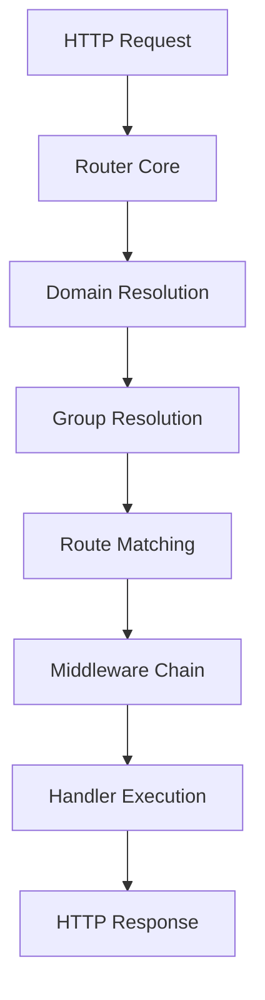

# Router Core Module

The router core is the central component of the RTR router system, responsible for orchestrating the entire HTTP request handling pipeline.

## Overview

The router core implements the `http.Handler` interface and serves as the main entry point for all HTTP requests. It manages routes, groups, domains, and middleware execution while maintaining high performance and flexibility.

## Key Responsibilities

- **Request Dispatching**: Route incoming HTTP requests to appropriate handlers
- **Component Management**: Manage routes, groups, and domains
- **Middleware Orchestration**: Execute middleware chains in the correct order
- **Error Handling**: Provide centralized error handling and recovery
- **Configuration Integration**: Support both imperative and declarative configuration

## Core Interface

### RouterInterface

```go
type RouterInterface interface {
    // Prefix management
    GetPrefix() string
    SetPrefix(prefix string) RouterInterface
    
    // Route management
    AddRoute(route RouteInterface) RouterInterface
    AddRoutes(routes []RouteInterface) RouterInterface
    GetRoutes() []RouteInterface
    
    // Group management
    AddGroup(group GroupInterface) RouterInterface
    AddGroups(groups []GroupInterface) RouterInterface
    GetGroups() []GroupInterface
    
    // Domain management
    AddDomain(domain DomainInterface) RouterInterface
    AddDomains(domains []DomainInterface) RouterInterface
    GetDomains() []DomainInterface
    
    // Middleware management
    AddBeforeMiddlewares(middlewares []MiddlewareInterface) RouterInterface
    AddAfterMiddlewares(middlewares []MiddlewareInterface) RouterInterface
    GetBeforeMiddlewares() []MiddlewareInterface
    GetAfterMiddlewares() []MiddlewareInterface
    
    // HTTP handler
    ServeHTTP(w http.ResponseWriter, r *http.Request)
    
    // Utility methods
    List()
    String() string
}
```

## Implementation Details

### Request Processing Pipeline



### Router Implementation

The router is implemented as `routerImpl` struct:

```go
type routerImpl struct {
    prefix             string
    routes             []RouteInterface
    groups             []GroupInterface
    domains            []DomainInterface
    beforeMiddlewares  []MiddlewareInterface
    afterMiddlewares   []MiddlewareInterface
    metadata           map[string]interface{}
}
```

### Constructor Functions

#### NewRouter
```go
func NewRouter() RouterInterface {
    return &routerImpl{
        routes:   make([]RouteInterface, 0),
        groups:   make([]GroupInterface, 0),
        domains:  make([]DomainInterface, 0),
        metadata: make(map[string]interface{}),
    }
}
```

#### NewRouterFromConfig
```go
func NewRouterFromConfig(config RouterConfig) RouterInterface {
    router := NewRouter()
    
    // Set metadata
    router.SetMetadata(config.Metadata)
    
    // Add middleware
    if len(config.BeforeMiddleware) > 0 {
        middleware := rtr.MiddlewareConfigsToInterfaces(config.BeforeMiddleware)
        router.AddBeforeMiddlewares(middleware)
    }
    
    // Add routes, groups, domains
    // ... implementation details
    
    return router
}
```

## Core Methods

### ServeHTTP

The main request handling method:

```go
func (router *routerImpl) ServeHTTP(w http.ResponseWriter, r *http.Request) {
    // 1. Apply global before middleware
    // 2. Resolve domain
    // 3. Resolve groups
    // 4. Match route
    // 5. Execute middleware chain
    // 6. Execute handler
    // 7. Apply global after middleware
}
```

### Route Management

#### AddRoute
```go
func (router *routerImpl) AddRoute(route RouteInterface) RouterInterface {
    router.routes = append(router.routes, route)
    return router
}
```

#### AddRoutes
```go
func (router *routerImpl) AddRoutes(routes []RouteInterface) RouterInterface {
    router.routes = append(router.routes, routes...)
    return router
}
```

### Group Management

#### AddGroup
```go
func (router *routerImpl) AddGroup(group GroupInterface) RouterInterface {
    router.groups = append(router.groups, group)
    return router
}
```

### Domain Management

#### AddDomain
```go
func (router *routerImpl) AddDomain(domain DomainInterface) RouterInterface {
    router.domains = append(router.domains, domain)
    return router
}
```

### Middleware Management

#### AddBeforeMiddlewares
```go
func (router *routerImpl) AddBeforeMiddlewares(middlewares []MiddlewareInterface) RouterInterface {
    router.beforeMiddlewares = append(router.beforeMiddlewares, middlewares...)
    return router
}
```

#### AddAfterMiddlewares
```go
func (router *routerImpl) AddAfterMiddlewares(middlewares []MiddlewareInterface) RouterInterface {
    router.afterMiddlewares = append(router.afterMiddlewares, middlewares...)
    return router
}
```

## Request Resolution

### Domain Resolution

The router first attempts to match the request against configured domains:

```go
func (router *routerImpl) resolveDomain(host string) DomainInterface {
    for _, domain := range router.domains {
        if domain.Matches(host) {
            return domain
        }
    }
    return nil // No domain match, use default routing
}
```

### Group Resolution

Within the selected domain, the router resolves matching groups:

```go
func (router *routerImpl) resolveGroups(path string, domain DomainInterface) []GroupInterface {
    var matchedGroups []GroupInterface
    
    // Check domain groups first
    if domain != nil {
        matchedGroups = append(matchedGroups, resolveGroupsFromDomain(domain, path)...)
    }
    
    // Check router groups
    matchedGroups = append(matchedGroups, resolveGroupsFromRouter(router, path)...)
    
    return matchedGroups
}
```

### Route Matching

The router attempts to match the request against routes:

```go
func (router *routerImpl) matchRoute(method, path string, domain DomainInterface, groups []GroupInterface) (RouteInterface, map[string]string) {
    // Check domain routes
    if domain != nil {
        if route, params := matchRoutes(domain.GetRoutes(), method, path); route != nil {
            return route, params
        }
    }
    
    // Check group routes
    for _, group := range groups {
        if route, params := matchRoutes(group.GetRoutes(), method, path); route != nil {
            return route, params
        }
    }
    
    // Check router routes
    if route, params := matchRoutes(router.routes, method, path); route != nil {
        return route, params
    }
    
    return nil, nil // No match found
}
```

## Middleware Execution

### Chain Construction

The router builds the middleware chain based on the resolved components:

```go
func (router *routerImpl) buildMiddlewareChain(route RouteInterface, domain DomainInterface, groups []GroupInterface) []MiddlewareInterface {
    var chain []MiddlewareInterface
    
    // Global before middleware
    chain = append(chain, router.beforeMiddlewares...)
    
    // Domain before middleware
    if domain != nil {
        chain = append(chain, domain.GetBeforeMiddlewares()...)
    }
    
    // Group before middleware
    for _, group := range groups {
        chain = append(chain, group.GetBeforeMiddlewares()...)
    }
    
    // Route before middleware
    chain = append(chain, route.GetBeforeMiddlewares()...)
    
    return chain
}
```

### Chain Execution

```go
func (router *routerImpl) executeMiddlewareChain(chain []MiddlewareInterface, handler http.Handler) http.Handler {
    for i := len(chain) - 1; i >= 0; i-- {
        handler = chain[i].Execute(handler)
    }
    return handler
}
```

## Error Handling

### Panic Recovery

The router includes built-in panic recovery:

```go
func (router *routerImpl) recoverPanic(w http.ResponseWriter, r *http.Request) {
    if err := recover(); err != nil {
        log.Printf("Panic recovered: %v\n", err)
        http.Error(w, "Internal Server Error", http.StatusInternalServerError)
    }
}
```

### Error Response

```go
func (router *routerImpl) handleError(w http.ResponseWriter, r *http.Request, err error) {
    if err != nil {
        http.Error(w, err.Error(), http.StatusInternalServerError)
        return
    }
    
    // Default 404 response
    w.WriteHeader(http.StatusNotFound)
    w.Write([]byte("404 Not Found"))
}
```

## Performance Optimizations

### Route Matching Optimization

- **Early Termination**: Stop matching on first successful route
- **Method Filtering**: Filter routes by HTTP method before path matching
- **Parameter Caching**: Cache extracted parameters for reuse

### Memory Management

- **Slice Pre-allocation**: Pre-allocate slices where possible
- **Object Reuse**: Reuse objects where appropriate
- **Minimal Allocations**: Minimize memory allocations in hot paths

## Configuration Support

### Imperative Configuration

```go
router := rtr.NewRouter()
router.AddRoute(rtr.Get("/", handler))
router.AddBeforeMiddlewares([]rtr.MiddlewareInterface{middleware})
```

### Declarative Configuration

```go
config := rtr.RouterConfig{
    Routes: []rtr.RouteConfig{
        rtr.GET("/", handler).WithName("Home"),
    },
    BeforeMiddleware: []rtr.MiddlewareConfig{
        rtr.NewMiddlewareConfig("Logger", middleware),
    },
}

router := rtr.NewRouterFromConfig(config)
```

## Debugging and Monitoring

### Route Listing

```go
router.List()
// Displays formatted table of all routes, groups, and middleware
```

### String Representation

```go
fmt.Println(router.String())
// Returns string representation of router configuration
```

### Request Tracing

Add debugging middleware for request tracing:

```go
router.AddBeforeMiddlewares([]rtr.MiddlewareInterface{
    rtr.NewAnonymousMiddleware(func(next http.Handler) http.Handler {
        return http.HandlerFunc(func(w http.ResponseWriter, r *http.Request) {
            start := time.Now()
            fmt.Printf("Request: %s %s\n", r.Method, r.URL.Path)
            next.ServeHTTP(w, r)
            fmt.Printf("Duration: %v\n", time.Since(start))
        })
    }),
})
```

## Usage Examples

### Basic Router Setup

```go
func main() {
    router := rtr.NewRouter()
    
    // Add routes
    router.AddRoute(rtr.Get("/", func(w http.ResponseWriter, r *http.Request) {
        w.Write([]byte("Hello, World!"))
    }))
    
    // Add middleware
    router.AddBeforeMiddlewares([]rtr.MiddlewareInterface{
        rtr.NewAnonymousMiddleware(loggingMiddleware),
    })
    
    // Start server
    http.ListenAndServe(":8080", router)
}
```

### Advanced Router Configuration

```go
func setupRouter() rtr.RouterInterface {
    router := rtr.NewRouter()
    
    // Global middleware
    router.AddBeforeMiddlewares([]rtr.MiddlewareInterface{
        rtr.NewMiddleware("Recovery", middlewares.RecoveryMiddleware),
        rtr.NewMiddleware("Logger", middlewares.LoggerMiddleware),
    })
    
    // Add groups
    apiGroup := rtr.NewGroup().SetPrefix("/api/v1")
    apiGroup.AddRoute(rtr.Get("/users", usersHandler))
    router.AddGroup(apiGroup)
    
    // Add domains
    apiDomain := rtr.NewDomain("api.example.com")
    apiDomain.AddRoute(rtr.Get("/status", statusHandler))
    router.AddDomain(apiDomain)
    
    return router
}
```

## Testing

### Unit Testing Router

```go
func TestRouterServeHTTP(t *testing.T) {
    router := rtr.NewRouter()
    router.AddRoute(rtr.Get("/test", func(w http.ResponseWriter, r *http.Request) {
        w.WriteHeader(http.StatusOK)
        w.Write([]byte("test"))
    }))
    
    req := httptest.NewRequest("GET", "/test", nil)
    w := httptest.NewRecorder()
    
    router.ServeHTTP(w, req)
    
    assert.Equal(t, http.StatusOK, w.Code)
    assert.Equal(t, "test", w.Body.String())
}
```

### Integration Testing

```go
func TestRouterIntegration(t *testing.T) {
    router := setupTestRouter()
    
    server := httptest.NewServer(router)
    defer server.Close()
    
    resp, err := http.Get(server.URL + "/test")
    require.NoError(t, err)
    defer resp.Body.Close()
    
    assert.Equal(t, http.StatusOK, resp.StatusCode)
}
```

## Best Practices

### 1. Organize Routes with Groups

```go
// Good: Use groups for organization
apiGroup := rtr.NewGroup().SetPrefix("/api/v1")
apiGroup.AddRoute(rtr.Get("/users", usersHandler))
router.AddGroup(apiGroup)

// Avoid: Flat route structure
router.AddRoute(rtr.Get("/api/v1/users", usersHandler))
```

### 2. Use Named Middleware

```go
// Good: Named middleware for debugging
router.AddBeforeMiddlewares([]rtr.MiddlewareInterface{
    rtr.NewMiddleware("Auth", authMiddleware),
})

// Acceptable: Anonymous middleware
router.AddBeforeMiddlewares([]rtr.MiddlewareInterface{
    rtr.NewAnonymousMiddleware(authMiddleware),
})
```

### 3. Configure Error Handling

```go
router.AddBeforeMiddlewares([]rtr.MiddlewareInterface{
    rtr.NewMiddleware("Recovery", middlewares.RecoveryMiddleware),
})
```

## See Also

- [Routes Module](routes.md) - Route management and matching
- [Groups Module](groups.md) - Route grouping and organization
- [Domains Module](domains.md) - Domain-based routing
- [Middleware Module](middleware.md) - Middleware system
- [API Reference](../api_reference.md) - Complete API documentation
