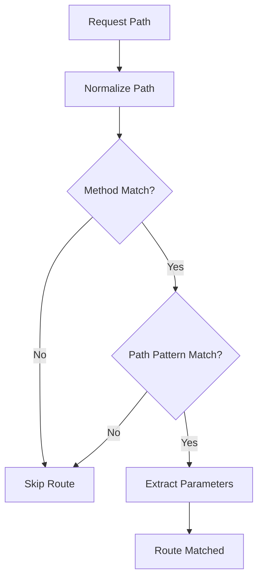

# Routes Module

The routes module manages individual route definitions, path matching, parameter extraction, and handler execution in the RTR router system.

## Overview

Routes are the fundamental building blocks that map HTTP methods and path patterns to handler functions. Each route can have multiple handler types, middleware, and metadata.

## Key Features

- **Multiple Handler Types**: Support for standard, JSON, HTML, CSS, XML, text, and JavaScript handlers
- **Path Parameters**: Advanced parameter extraction with optional and greedy parameters
- **Method Routing**: Support for all HTTP methods with convenient shortcuts
- **Middleware Support**: Route-specific middleware execution
- **Metadata**: Extensible metadata for documentation and tooling

## Core Interface

### RouteInterface

```go
type RouteInterface interface {
    // HTTP method and path
    GetMethod() string
    SetMethod(method string) RouteInterface
    GetPath() string
    SetPath(path string) RouteInterface
    
    // Handlers
    GetHandler() StdHandler
    SetHandler(handler StdHandler) RouteInterface
    GetStringHandler() StringHandler
    SetStringHandler(handler StringHandler) RouteInterface
    GetHTMLHandler() HTMLHandler
    SetHTMLHandler(handler HTMLHandler) RouteInterface
    GetJSONHandler() JSONHandler
    SetJSONHandler(handler JSONHandler) RouteInterface
    GetCSSHandler() CSSHandler
    SetCSSHandler(handler CSSHandler) RouteInterface
    GetXMLHandler() XMLHandler
    SetXMLHandler(handler XMLHandler) RouteInterface
    GetTextHandler() TextHandler
    SetTextHandler(handler TextHandler) RouteInterface
    GetJSHandler() JSHandler
    SetJSHandler(handler JSHandler) RouteInterface
    GetErrorHandler() ErrorHandler
    SetErrorHandler(handler ErrorHandler) RouteInterface
    
    // Route metadata
    GetName() string
    SetName(name string) RouteInterface
    GetMetadata() map[string]interface{}
    SetMetadata(metadata map[string]interface{}) RouteInterface
    
    // Middleware
    AddBeforeMiddlewares(middlewares []MiddlewareInterface) RouteInterface
    AddAfterMiddlewares(middlewares []MiddlewareInterface) RouteInterface
    GetBeforeMiddlewares() []MiddlewareInterface
    GetAfterMiddlewares() []MiddlewareInterface
    
    // Utility methods
    String() string
}
```

## Handler Types

### Standard Handler

Full HTTP control with `http.ResponseWriter` and `*http.Request`:

```go
func(w http.ResponseWriter, r *http.Request) {
    w.Header().Set("Content-Type", "application/json")
    w.WriteHeader(http.StatusOK)
    w.Write([]byte(`{"message": "success"}`))
}
```

### Specialized Handlers

#### HTMLHandler
```go
func(w http.ResponseWriter, r *http.Request) string {
    return `<!DOCTYPE html>
<html>
<head><title>My Page</title></head>
<body><h1>Hello, World!</h1></body>
</html>`
}
```
Automatically sets `Content-Type: text/html; charset=utf-8`

#### JSONHandler
```go
func(w http.ResponseWriter, r *http.Request) string {
    return `{"status": "ok", "version": "1.0.0"}`
}
```
Automatically sets `Content-Type: application/json`

#### CSSHandler
```go
func(w http.ResponseWriter, r *http.Request) string {
    return "body { font-family: Arial; color: #333; }"
}
```
Automatically sets `Content-Type: text/css`

#### XMLHandler
```go
func(w http.ResponseWriter, r *http.Request) string {
    return `<?xml version="1.0"?><data><message>Hello XML</message></data>`
}
```
Automatically sets `Content-Type: application/xml`

#### TextHandler
```go
func(w http.ResponseWriter, r *http.Request) string {
    return "User-agent: *\nAllow: /\nDisallow: /admin/"
}
```
Automatically sets `Content-Type: text/plain; charset=utf-8`

#### JSHandler
```go
func(w http.ResponseWriter, r *http.Request) string {
    return "console.log('Hello from RTR!');"
}
```
Automatically sets `Content-Type: application/javascript`

#### ErrorHandler
```go
func(w http.ResponseWriter, r *http.Request) error {
    if someCondition {
        return errors.New("something went wrong")
    }
    return nil // Success, no content written
}
```

### Handler Priority

When multiple handlers are set, the router uses this priority order:

1. `StdHandler` (highest priority)
2. `HTMLHandler`
3. `JSONHandler`
4. `CSSHandler`
5. `XMLHandler`
6. `TextHandler`
7. `JSHandler`
8. `ErrorHandler`

## Path Patterns

### Basic Parameters

Required parameters using `:param` syntax:

```go
router.AddRoute(rtr.Get("/users/:id", func(w http.ResponseWriter, r *http.Request) {
    userID := rtr.MustGetParam(r, "id")
    w.Write([]byte("User ID: " + userID))
}))
```

### Optional Parameters

Optional parameters using `:param?` syntax:

```go
// Matches both /articles/tech and /articles/tech/123
router.AddRoute(rtr.Get("/articles/:category/:id?", func(w http.ResponseWriter, r *http.Request) {
    category := rtr.MustGetParam(r, "category")
    if id, exists := rtr.GetParam(r, "id"); exists {
        w.Write([]byte("Category: " + category + ", ID: " + id))
    } else {
        w.Write([]byte("Category: " + category))
    }
}))
```

### Greedy Parameters

Greedy parameters using `:param...` syntax (must be last segment):

```go
// Matches /files/images/photo.jpg, /files/user/docs/file.pdf, etc.
router.AddRoute(rtr.Get("/files/:path...", func(w http.ResponseWriter, r *http.Request) {
    filePath := rtr.MustGetParam(r, "path")
    w.Write([]byte("File path: " + filePath))
}))
```

### Brace-style Parameters

Alternative syntax compatible with standard library patterns:

```go
// These are equivalent:
router.AddRoute(rtr.Get("/users/:id", handler))
router.AddRoute(rtr.Get("/users/{id}", handler))
router.AddRoute(rtr.Get("/users/{id?}", handler))
router.AddRoute(rtr.Get("/users/{path...}", handler))
```

## Route Creation

### Constructor Functions

#### NewRoute
```go
route := rtr.NewRoute().
    SetMethod("GET").
    SetPath("/users").
    SetHandler(handler).
    SetName("List Users")
```

### HTTP Method Shortcuts

```go
// Standard HTTP methods
rtr.Get(path, handler)
rtr.Post(path, handler)
rtr.Put(path, handler)
rtr.Delete(path, handler)
rtr.Patch(path, handler)
rtr.Options(path, handler)
rtr.Head(path, handler)

// Specialized handler shortcuts
rtr.GetHTML(path, htmlHandler)
rtr.PostHTML(path, htmlHandler)
rtr.GetJSON(path, jsonHandler)
rtr.PostJSON(path, jsonHandler)
rtr.GetCSS(path, cssHandler)
rtr.GetXML(path, xmlHandler)
rtr.GetText(path, textHandler)
rtr.GetJS(path, jsHandler)
```

### Method Chaining

```go
route := rtr.NewRoute().
    SetMethod("GET").
    SetPath("/api/users").
    SetHandler(usersHandler).
    SetName("List Users").
    SetMetadata("version", "1.0").
    SetMetadata("deprecated", false).
    AddBeforeMiddlewares([]rtr.MiddlewareInterface{
        rtr.NewAnonymousMiddleware(authMiddleware),
    })
```

## Route Configuration

### Declarative Configuration

```go
config := rtr.RouteConfig{
    Method: "GET",
    Path:   "/users",
    Name:   "List Users",
    Handler: usersHandler,
    BeforeMiddleware: []rtr.MiddlewareConfig{
        rtr.NewMiddlewareConfig("Auth", authMiddleware),
    },
    Metadata: map[string]interface{}{
        "version": "1.0",
        "public":  false,
    },
}
```

### Configuration Helpers

```go
// Using helper functions
route := rtr.GET("/users", usersHandler).
    WithName("List Users").
    WithBeforeMiddleware(rtr.NewAnonymousMiddleware(authMiddleware)).
    WithMetadata("version", "1.0")
```

## Parameter Functions

### GetParam
```go
func GetParam(r *http.Request, key string) (string, bool)
```
Safely gets a path parameter. Returns the value and a boolean indicating existence.

```go
if userID, exists := rtr.GetParam(r, "id"); exists {
    // Use userID
}
```

### MustGetParam
```go
func MustGetParam(r *http.Request, key string) string
```
Gets a required parameter. Panics if the parameter doesn't exist.

```go
userID := rtr.MustGetParam(r, "id") // Panics if "id" doesn't exist
```

### GetParams
```go
func GetParams(r *http.Request) map[string]string
```
Returns all path parameters as a map.

```go
params := rtr.GetParams(r)
for key, value := range params {
    fmt.Printf("%s = %s\n", key, value)
}
```

## Route Matching

### Matching Algorithm



### Pattern Matching

The router uses a sophisticated pattern matching algorithm:

1. **Path Normalization**: Remove query strings, handle trailing slashes
2. **Method Filtering**: Filter routes by HTTP method
3. **Pattern Matching**: Match path patterns against request path
4. **Parameter Extraction**: Extract parameters during matching
5. **Validation**: Validate required parameters

### Performance Considerations

- **Early Termination**: Stop on first successful match
- **Method Filtering**: Filter by method before path matching
- **Parameter Caching**: Cache extracted parameters
- **Minimal Allocations**: Optimize for performance

## Middleware Integration

### Route-Level Middleware

```go
route := rtr.Get("/admin", adminHandler).
    AddBeforeMiddlewares([]rtr.MiddlewareInterface{
        rtr.NewAnonymousMiddleware(adminAuthMiddleware),
        rtr.NewAnonymousMiddleware(loggingMiddleware),
    }).
    AddAfterMiddlewares([]rtr.MiddlewareInterface{
        rtr.NewAnonymousMiddleware(responseTimeMiddleware),
    })
```

### Middleware Execution Order

For route-specific middleware:
1. Route before middleware
2. Handler execution
3. Route after middleware

## Usage Examples

### Basic Route

```go
router.AddRoute(rtr.Get("/", func(w http.ResponseWriter, r *http.Request) {
    w.Write([]byte("Hello, World!"))
}))
```

### JSON API Route

```go
router.AddRoute(rtr.GetJSON("/api/status", func(w http.ResponseWriter, r *http.Request) string {
    return `{
        "status": "ok",
        "version": "1.0.0",
        "timestamp": "` + time.Now().Format(time.RFC3339) + `"
    }`
}))
```

### Route with Parameters

```go
router.AddRoute(rtr.Get("/users/:id", func(w http.ResponseWriter, r *http.Request) {
    userID := rtr.MustGetParam(r, "id")
    
    // Validate parameter
    if !isValidUserID(userID) {
        http.Error(w, "Invalid user ID", http.StatusBadRequest)
        return
    }
    
    // Get user data
    user := getUserByID(userID)
    if user == nil {
        http.Error(w, "User not found", http.StatusNotFound)
        return
    }
    
    w.Header().Set("Content-Type", "application/json")
    json.NewEncoder(w).Encode(user)
}))
```

### Route with Optional Parameters

```go
router.AddRoute(rtr.Get("/search", func(w http.ResponseWriter, r *http.Request) {
    query, hasQuery := rtr.GetParam(r, "query")
    page, hasPage := rtr.GetParam(r, "page")
    
    results := searchProducts(query, page)
    
    w.Header().Set("Content-Type", "application/json")
    json.NewEncoder(w).Encode(results)
}))
```

### Route with Middleware

```go
router.AddRoute(rtr.Post("/api/users", createUserHandler).
    AddBeforeMiddlewares([]rtr.MiddlewareInterface{
        rtr.NewAnonymousMiddleware(rateLimitMiddleware),
        rtr.NewAnonymousMiddleware(validateJSONMiddleware),
    }).
    AddAfterMiddlewares([]rtr.MiddlewareInterface{
        rtr.NewAnonymousMiddleware(logResponseMiddleware),
    }))
```

## Testing Routes

### Unit Testing

```go
func TestRouteHandler(t *testing.T) {
    route := rtr.NewRoute().
        SetMethod("GET").
        SetPath("/test").
        SetHandler(func(w http.ResponseWriter, r *http.Request) {
            w.WriteHeader(http.StatusOK)
            w.Write([]byte("test response"))
        })
    
    assert.Equal(t, "GET", route.GetMethod())
    assert.Equal(t, "/test", route.GetPath())
    assert.NotNil(t, route.GetHandler())
}
```

### Integration Testing

```go
func TestRouteExecution(t *testing.T) {
    router := rtr.NewRouter()
    router.AddRoute(rtr.Get("/test", func(w http.ResponseWriter, r *http.Request) {
        w.WriteHeader(http.StatusOK)
        w.Write([]byte("test"))
    }))
    
    req := httptest.NewRequest("GET", "/test", nil)
    w := httptest.NewRecorder()
    
    router.ServeHTTP(w, req)
    
    assert.Equal(t, http.StatusOK, w.Code)
    assert.Equal(t, "test", w.Body.String())
}
```

### Parameter Testing

```go
func TestParameterExtraction(t *testing.T) {
    router := rtr.NewRouter()
    router.AddRoute(rtr.Get("/users/:id", func(w http.ResponseWriter, r *http.Request) {
        id := rtr.MustGetParam(r, "id")
        w.Write([]byte(id))
    }))
    
    tests := []struct {
        path         string
        expectedBody string
    }{
        {"/users/123", "123"},
        {"/users/abc", "abc"},
        {"/users/user-123", "user-123"},
    }
    
    for _, tt := range tests {
        t.Run(tt.path, func(t *testing.T) {
            req := httptest.NewRequest("GET", tt.path, nil)
            w := httptest.NewRecorder()
            router.ServeHTTP(w, req)
            
            assert.Equal(t, http.StatusOK, w.Code)
            assert.Equal(t, tt.expectedBody, w.Body.String())
        })
    }
}
```

## Best Practices

### 1. Use Appropriate Handler Types

```go
// Good: Use JSON handler for JSON responses
router.AddRoute(rtr.GetJSON("/api/status", func(w http.ResponseWriter, r *http.Request) string {
    return `{"status": "ok"}`
}))

// Good: Use HTML handler for HTML responses
router.AddRoute(rtr.GetHTML("/page", func(w http.ResponseWriter, r *http.Request) string {
    return "<h1>Hello, World!</h1>"
}))

// Use standard handler for complex responses
router.AddRoute(rtr.Get("/complex", func(w http.ResponseWriter, r *http.Request) {
    // Complex logic with custom headers
}))
```

### 2. Validate Parameters

```go
router.AddRoute(rtr.Get("/users/:id", func(w http.ResponseWriter, r *http.Request) {
    userID := rtr.MustGetParam(r, "id")
    
    // Validate parameter
    if !isValidUUID(userID) {
        http.Error(w, "Invalid user ID format", http.StatusBadRequest)
        return
    }
    
    // Continue with valid parameter
}))
```

### 3. Use Route Names for Documentation

```go
router.AddRoute(rtr.Get("/api/users", usersHandler).
    SetName("List Users").
    SetMetadata("description", "Returns a list of all users").
    SetMetadata("deprecated", false))
```

### 4. Organize Related Routes

```go
// Group related routes
userRoutes := []rtr.RouteInterface{
    rtr.Get("/users", listUsersHandler).SetName("List Users"),
    rtr.Post("/users", createUserHandler).SetName("Create User"),
    rtr.Get("/users/:id", getUserHandler).SetName("Get User"),
    rtr.Put("/users/:id", updateUserHandler).SetName("Update User"),
    rtr.Delete("/users/:id", deleteUserHandler).SetName("Delete User"),
}

router.AddRoutes(userRoutes)
```

## See Also

- [Router Core Module](router_core.md) - Main router component
- [Handlers Module](handlers.md) - Handler types and execution
- [Parameters Module](parameters.md) - Parameter extraction and validation
- [Middleware Module](middleware.md) - Middleware system
- [API Reference](../api_reference.md) - Complete API documentation
