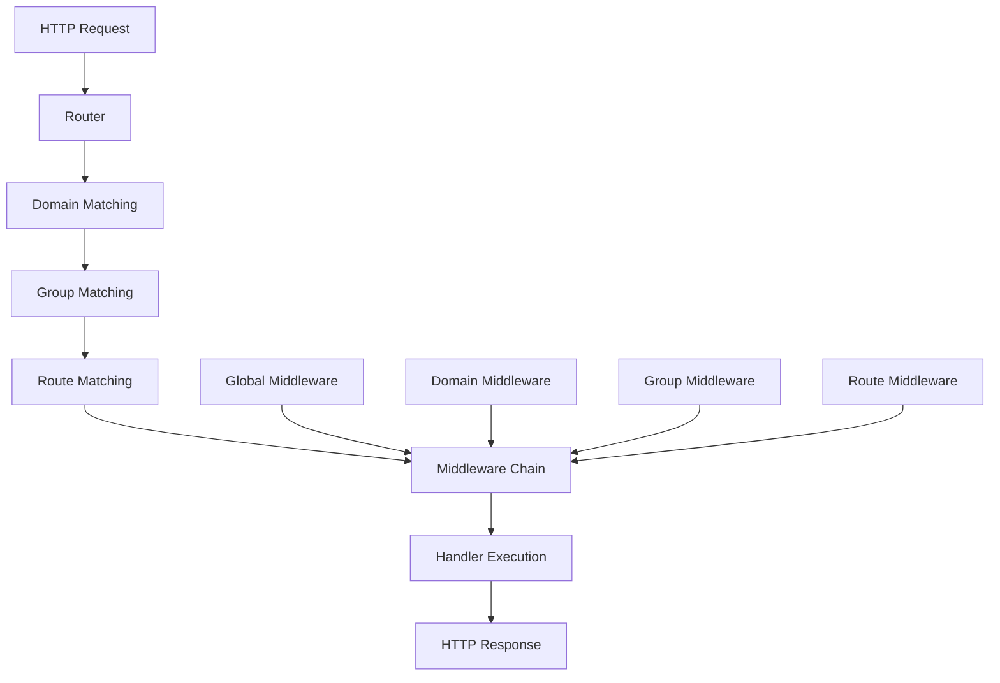

# RTR Router Overview

RTR (Router) is a high-performance, flexible, and feature-rich HTTP router for Go applications designed for modern web development. It provides a clean, intuitive API for building RESTful APIs and web applications with advanced routing capabilities.

## Key Features

- **High Performance**: Optimized for speed with minimal allocations and efficient routing algorithms
- **RESTful Routing**: Intuitive API for defining RESTful endpoints with HTTP method shortcuts
- **Middleware Support**: Flexible middleware chaining with before/after execution at multiple levels
- **Route Groups**: Organize routes with shared prefixes and middleware for better structure
- **Domain-Based Routing**: Handle different domains/subdomains with sophisticated matching patterns
- **Multiple Handler Types**: Support for various response formats (JSON, HTML, XML, CSS, JavaScript, etc.)
- **Path Parameters**: Advanced parameter extraction with optional and greedy parameters
- **Declarative Configuration**: Define routes using configuration objects for better maintainability
- **Standard Library Compatible**: Implements `http.Handler` for seamless integration
- **Comprehensive Testing**: High test coverage with extensive test cases

## Architecture

RTR follows a layered architecture that provides flexibility while maintaining simplicity:



## Core Components

### Router
The main entry point that handles HTTP requests and manages the routing hierarchy. Supports both imperative and declarative configuration approaches.

### Routes
Individual route definitions that map HTTP methods and path patterns to handler functions. Supports multiple handler types for different response formats.

### Groups
Collections of routes that share common prefixes and middleware. Enable hierarchical organization of related endpoints.

### Domains
Domain-specific routing that allows different routing configurations based on the request hostname. Supports wildcard subdomains and port matching.

### Middleware
Flexible middleware system that supports before/after execution at router, domain, group, and route levels.

## Handler Types

RTR provides specialized handler types for different use cases:

- **Standard Handler**: Full HTTP control with `http.ResponseWriter` and `*http.Request`
- **String Handlers**: Return content as strings with automatic header management
- **Content Handlers**: HTML, JSON, XML, CSS, JavaScript with automatic Content-Type headers
- **Error Handler**: Centralized error handling with automatic error response generation

## Quick Example

```go
package main

import (
    "net/http"
    "github.com/dracory/rtr"
)

func main() {
    router := rtr.NewRouter()
    
    // Add a simple route
    router.AddRoute(rtr.Get("/", func(w http.ResponseWriter, r *http.Request) {
        w.Write([]byte("Hello, World!"))
    }))
    
    // Add a JSON API route
    router.AddRoute(rtr.GetJSON("/api/status", func(w http.ResponseWriter, r *http.Request) string {
        return `{"status": "ok", "version": "1.0.0"}`
    }))
    
    // Create an API group with middleware
    apiGroup := rtr.NewGroup().SetPrefix("/api/v1")
    apiGroup.AddRoute(rtr.Get("/users", handleUsers))
    router.AddGroup(apiGroup)
    
    http.ListenAndServe(":8080", router)
}
```

## Design Philosophy

RTR is built around these core principles:

1. **Simplicity**: Easy to understand and use with sensible defaults
2. **Flexibility**: Supports multiple usage patterns and configuration approaches
3. **Performance**: Optimized for high-throughput applications
4. **Extensibility**: Clean interfaces for custom middleware and handlers
5. **Compatibility**: Works seamlessly with the Go standard library and ecosystem

## Use Cases

RTR is well-suited for:

- **REST APIs**: Building JSON APIs with automatic content-type handling
- **Web Applications**: Full-featured web applications with HTML responses
- **Microservices**: Lightweight routing for service-to-service communication
- **Multi-domain Applications**: Applications serving multiple domains from a single binary
- **Static File Servers**: Efficient serving of static assets with custom headers

## See Also

- [Getting Started Guide](getting_started.md) - Learn how to install and use RTR
- [Architecture Documentation](architecture.md) - Deep dive into the system architecture
- [API Reference](api_reference.md) - Complete API documentation
- [Examples](../examples/) - Practical usage examples
